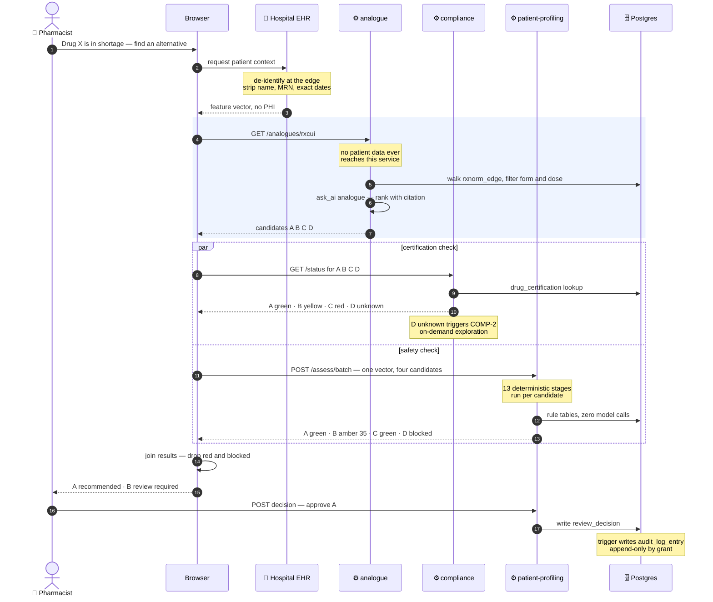
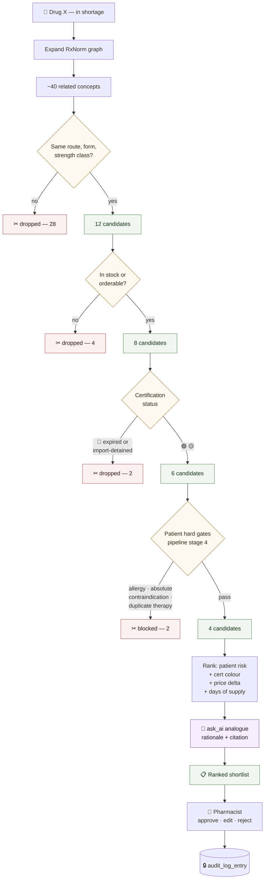
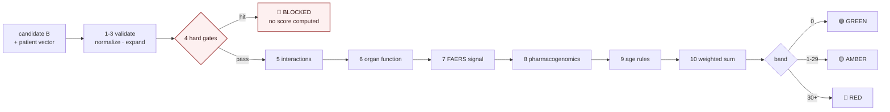

# Analog Search × Patient Profiling — End-to-End Flow

What happens between a pharmacist typing "find me an alternative" and a decision being written
to the audit log. Spans `analogue`, `compliance` and `patient-profiling`.

---

## 1. The journey

### Why the browser orchestrates

The three calls fan out from the browser, not from `analogue`. That follows
[services.md](services.md) §2 — the browser calls the services directly — but here it buys
something better than consistency:

**`analogue` never sees the patient.** It ranks by therapeutic equivalence and price, which is
all it needs. Clinical data reaches exactly one service, and it is the one designed around that
constraint. If `analogue` orchestrated instead, the patient vector would have to be handed to a
service that has no use for it and does call Gemini.

The `par` block is one round trip, not two — certification and safety are independent, so they
run concurrently. The vector is sent once, in a batch call, not once per candidate.

---

## 2. The funnel

Forty related concepts in RxNorm become one recommendation. Each stage removes candidates for a
different reason, and every removal is recorded.

**Order matters.** Cheap deterministic filters run before expensive ones, and the model runs
last — on four candidates, not forty. Certification is checked before patient safety because it
is a single indexed lookup, while the safety pipeline is thirteen stages.

**Nothing disappears silently.** A dropped candidate keeps its reason, and the UI can show
*"2 alternatives excluded: certification expired"*. A pharmacist who cannot see what was filtered
out cannot trust what remains.

---

## 3. Per-candidate detail

What stage 4 of the funnel actually runs, for one candidate:

Full stage table and weights: [patient-pipeline.md](patient-pipeline.md).

---

## 4. What the pharmacist sees

| Candidate | Cert | Patient risk | Price Δ | Verdict |
|---|---|---|---|---|
| **A** — ingredient equivalent | 🟢 active | 🟢 0 | −18% | ✅ Recommended |
| **B** — same class | 🟡 recall ongoing | 🟡 35 — moderate interaction with warfarin | −31% | ⚠ Review |
| ~~C~~ | 🔴 listing expired | — | — | Excluded |
| ~~D~~ | ⚪ unknown | 🚫 blocked — penicillin allergy | — | Excluded |

Both surviving rows carry a citation and the findings behind the colour. **Nothing on this screen
was decided by a model** — the ranking is arithmetic, the exclusions are rules, and the only
model output is the rationale text next to A.

The pharmacist approves. The trigger writes the audit entry. That row is the product's compliance
value, and it exists whether or not anyone ever reads it.
