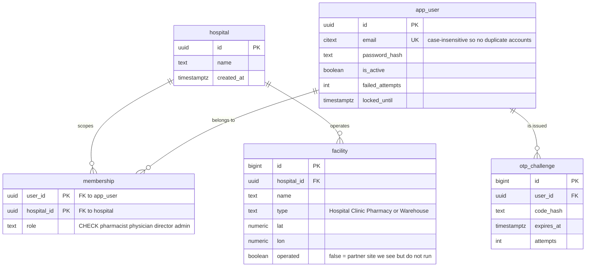
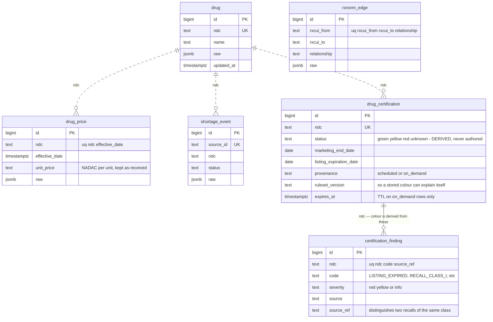
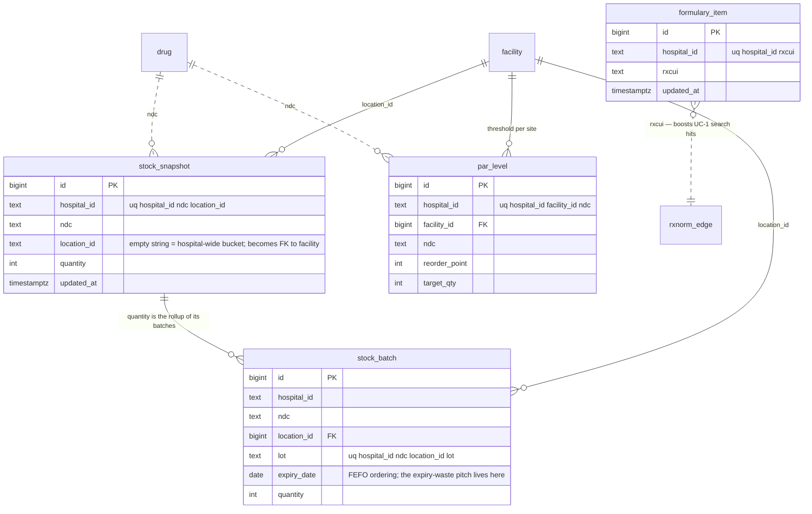
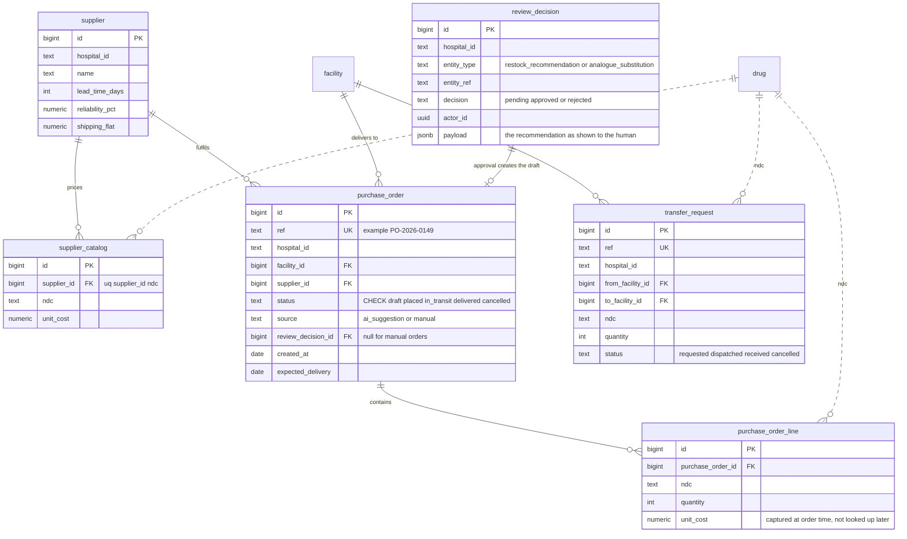
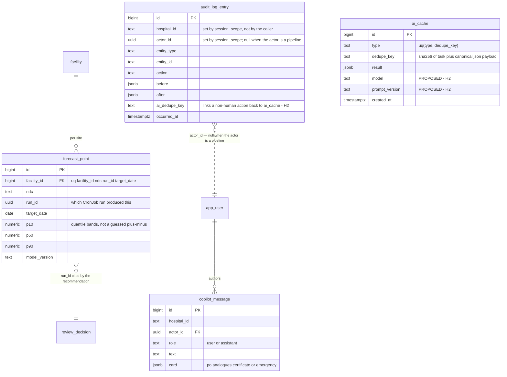

# MedStock AI — Database Schema

One Postgres database shared by all seven services (`docs/services.md` §0 — the deploy
boundary is real, the data boundary is not). This is the schema behind the features in
[backend-features.md](backend-features.md) and the flows in [userflows.md](userflows.md).

**Legend**

- `───` solid line — a real foreign key.
- `╌╌╌` dashed line — a **logical** join on a natural key (`ndc`, `rxcui`, `hospital_id`),
  with no FK. This is deliberate for reference↔tenant joins: reference rows are written by
  `ingest` on its own schedule and must not block a tenant write.
- ✅ exists in `shared/medstock_shared/models.py` · ❌ proposed.

---

## Table registry

| Table | Class | Owner service | Status |
|---|---|---|---|
| `hospital` | identity | `auth` | ✅ |
| `app_user` | identity | `auth` | ✅ |
| `membership` | identity | `auth` | ✅ |
| `otp_challenge` | identity | `auth` | ❌ A2 |
| `drug` | reference | `ingest` | ✅ |
| `rxnorm_edge` | reference | `ingest` | ✅ |
| `drug_price` | reference | `ingest` | ✅ |
| `shortage_event` | reference | `ingest` | ✅ |
| `drug_certification` | reference | `ingest` writes, `compliance` derives | ✅ |
| `certification_finding` | reference | `ingest` writes, `compliance` reads | ✅ |
| `formulary_item` | tenant | `inventory` | ✅ |
| `stock_snapshot` | tenant | `inventory` | ✅ |
| `facility` | tenant | `warehouse` | ✅ B1 |
| `storage_location` | tenant | `warehouse` | ✅ B1 — flat list per facility, `kind` ∈ room/fridge/freezer/cold_room |
| `consumption_daily` | tenant | `warehouse` writes (seed; later B4 rollup), `prediction` reads | ✅ — 3y daily usage history, `stockout` marks censored days |
| `location_condition` | tenant (via `storage_location` → `facility`) | `warehouse` | ✅ — hourly temp/humidity telemetry |
| `stock_batch` | tenant | `inventory` | ❌ B4 |
| `par_level` | tenant | `inventory` | ❌ B5 |
| `supplier` | tenant | `warehouse` | ❌ F2 |
| `supplier_catalog` | tenant | `warehouse` | ❌ F2 |
| `purchase_order` | tenant | `inventory` | ❌ F3 |
| `purchase_order_line` | tenant | `inventory` | ❌ F3 |
| `transfer_request` | tenant | `warehouse` | ❌ G2 |
| `review_decision` | tenant | `inventory` | ❌ F1 |
| `forecast_point` | tenant | `prediction` | ❌ E1 |
| `audit_log_entry` | tenant, append-only | Postgres trigger; read by `compliance` | ❌ H1 |
| `copilot_message` | tenant | copilot gateway | ❌ I2 |
| `ai_cache` | neither — global cache | `shared/ai.py` | ✅ |

Three classes, per `docs/services.md` §1.1: **reference** tables are global with no
`hospital_id` and no RLS; **tenant** tables carry `hospital_id` and are filtered by RLS via
`session_scope`, never by an application `WHERE`; **identity** tables are the documented
exception queried through `SessionLocal` directly, because login runs before there is a
`hospital_id` to set.

---

## 1. Identity and tenancy



`membership` carries the role, not `app_user` — "director at A, pharmacist at B" is the case
that would otherwise force an auth rewrite. `uq_membership_one_hospital_per_user` is the
"one hospital per user" decision; dropping that single constraint plus adding a hospital
picker at login is the whole multi-hospital change.

`role` values must stay in sync with the keys of `PERMS` in `shared/medstock_shared/auth.py`.

---

## 2. Reference data (written only by `ingest` CronJobs)



`rxnorm_edge` has no line to `drug`: it is keyed on RxCUI (the clinical id) while everything
else is keyed on NDC (the shelf id). Crossing the two is exactly what `analogue`'s
`GET /drugs/{rxcui}/packages` does, at query time against live RxNorm.

Every table keeps the source payload in `raw` and upserts on a natural key, so re-running a
CronJob is idempotent rather than duplicating rows.

---

## 3. Inventory and stock



`stock_batch` is the missing half of the product story: `stock_snapshot` today has no lot and
no expiry, so nothing in the schema can support FEFO, expiry alerts, or the "-84% expiry
waste" headline. Once batches exist, `stock_snapshot.quantity` should be a trigger-maintained
rollup rather than an independently written number.

---

## 4. Procurement and redistribution



`unit_cost` is copied onto `purchase_order_line` rather than joined from `supplier_catalog`,
so an order total stays reproducible after a price update — the same reason
`drug_certification` stores `ruleset_version`.

`review_decision` is the table the audit trigger in `docs/services.md` §1.3 already assumes
exists. Both order entry points converge on `purchase_order`; only the AI path carries a
`review_decision_id`.

`transfer_request` moving stock is **one** transaction that debits the source batch and
credits the destination — not two independent writes.

---

## 5. Forecasting, AI and audit



`ai_cache` is deliberately **not** a tenant table — no `hospital_id`, no RLS. What sits behind
`dedupe_key` is reference data (drug names, RxCUI, shortage text), never PHI, so two hospitals
asking the identical question share the identical cached answer. That is the point: the cache
works across the whole system, not once per tenant.

The two proposed columns close a real hole. Today a prompt edit changes the answer silently
under an unchanged `dedupe_key` — both a caching bug and an audit gap.

`audit_log_entry` is written by a trigger, never by application code:

```sql
CREATE TRIGGER audit_review_decision
  AFTER INSERT OR UPDATE ON review_decision
  FOR EACH ROW EXECUTE FUNCTION write_audit_entry();

REVOKE UPDATE, DELETE ON audit_log_entry FROM app_role;
```

"We remember to call `audit()`" is the same weak guarantee as "we remember to write
`WHERE hospital_id`", and with seven services it has to hold in seven codebases. Append-only
is a **grant**, not a convention — demonstrable in ten seconds at defense.

---

## Migration order

The proposed tables have a dependency order; taking them out of order means rewriting FKs.

1. **Fix `hospital_id` typing.** It is `Text` on the tenant tables and `UUID` on `hospital` —
   flagged in `models.py` as parallel-authoring drift. Ten new tables would otherwise inherit
   the wrong type. Do this first, while both tables are still nearly empty.
2. `facility` — B1 blocks stock scoping, orders, transfers, and forecasts alike. ✅ done
   (migration `20260817_warehouse`, with `storage_location`, `consumption_daily`,
   `location_condition`, storage-requirement columns on `drug`, and
   `stock_snapshot.facility_id` — the stock natural key is now
   `(hospital_id, ndc, facility_id, location_id)`, NULLS NOT DISTINCT).
3. `audit_log_entry` + `review_decision` + the trigger — H1. Every "AI suggested / pharmacist
   approved" claim in the UI is unbacked until these exist.
4. `stock_batch` + `par_level` — B4/B5, which make "critical" and "expiring" objective.
5. `supplier` → `supplier_catalog` → `purchase_order` → `purchase_order_line` — F2/F3.
6. `forecast_point` — E1, written by a CronJob, not in-request.
7. `transfer_request`, `otp_challenge`, `copilot_message` — leaf tables, any order.

Alembic autogenerate reads `Base.metadata`, so every table above must be imported into
`shared/medstock_shared/models.py` before its migration is generated.
