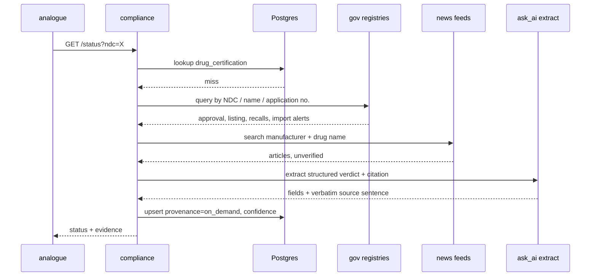

# `compliance` — Use Cases

Companion to [services.md](services.md) §3. Scope: the two use cases owned by `compliance`.

Status: **draft** — items marked `OPEN` change the architecture in [services.md](services.md)
and are not settled. Feed URLs marked `verify` follow the same convention as
`services/ingest` — placeholder until checked against a live response.

---

## 0. The two cases in one line each

| | Case | Trigger | Output |
|---|---|---|---|
| **COMP-1** | Certification traffic light | A pharmacist opens inventory | Green / Yellow / Red badge per stocked drug |
| **COMP-2** | Unknown-drug exploration | Analogue search returns a drug not in our certification table | A provisional certification record + citation |

COMP-1 is a scheduled read of formal government data. COMP-2 is an on-demand reach into the same
sources plus news, for a drug nobody has asked about before.

---

## 1. Use case diagram


The dotted `includes` edges are UML `<<include>>`. The dotted edges from `ingest` to `COMP-1A`
are **not** calls — `ingest` writes reference tables and `compliance` reads them. There is no
HTTP between them, consistent with [services.md](services.md) §1.1.

---

## 2. COMP-1 — the traffic light

### 2.1 Status rule

Evaluated per NDC, highest severity wins. **Red requires a formal government source.** News can
never produce Red — see §4.3.

| Status | Condition | Source |
|---|---|---|
| 🔴 **Red** | `marketing_end_date` in the past, or listing expired | NDC Directory |
| 🔴 | Application withdrawn or approval revoked | Drugs@FDA |
| 🔴 | Class I recall, status `ongoing` | Enforcement |
| 🔴 | Manufacturer on an import alert red list (DWPE) | Import Alerts |
| 🟡 **Yellow** | `marketing_end_date` within 90 days | NDC Directory |
| 🟡 | Class II or III recall, status `ongoing` | Enforcement |
| 🟡 | Open warning letter, or inspection classified OAI, against the labeler | Warning letters / ICD |
| 🟡 | GMP non-compliance statement for a foreign site | EudraGMDP |
| 🟡 | Informal signal above threshold | News (COMP-2B) |
| 🟢 **Green** | Present, marketing status active, none of the above | — |
| ⚪ **Unknown** | NDC not in the certification table | triggers COMP-2 |

The 90-day Yellow window is a constant, not a judgement call baked into a query — one place,
one number to defend.

### 2.2 Where the badge comes from

`compliance` owns the status. The inventory **page** shows it, but `inventory` the service is
not involved:

```
browser ──▶ /api/inventory/stock       ──▶ inventory   (what is on the shelf)
       └──▶ /api/compliance/status?ndc= ──▶ compliance  (what colour it is)
```

Two same-origin calls from one page, joined in the browser. This follows
[services.md](services.md) §2 — the browser calls the seven services directly — and avoids
making `compliance` an availability dependency of the stock list. If `compliance` is down the
shelf still renders; the badges go grey.

`OPEN` — the alternative is a SQL join inside `inventory`, which is cheaper for the client and
legitimate under the shared-schema design, but puts compliance logic in someone else's service.
Recommendation: two calls. Decide before the endpoint is written.

### 2.3 Endpoints

| Method | Path | Permission | Status | Notes |
|---|---|---|---|---|
| `GET` | `/status?ndc=…` | `inventory:read` | **built** | Batch: repeatable `ndc` param, max 100, one page of stock in one call |
| `GET` | `/certificates/{ndc}` | `inventory:read` | **built** | Full evidence — every finding behind the colour, with source URLs |
| `GET` | `/ruleset` | `inventory:read` | **built** | Every rule and threshold that can produce a colour |
| `GET` | `/export/compliance.csv` | `audit:read` | planned | Director surface, already sketched in services.md §3 |

`inventory:read` is reused rather than adding a `certificate:read` permission: every role that
can see the shelf needs to see the badge on it, and a change to `shared/auth.py` redeploys all
seven services (services.md §0).

**What is built today is COMP-1 only.** COMP-2 (§3) is designed but not implemented — an NDC with
no row comes back `unknown` and nothing explores it. The status rules live in
`shared/medstock_shared/certification.py`, the daily feed in
`services/ingest/app/certification.py`.

---

## 3. COMP-2 — exploring a drug we have never seen

Triggered when `analogue` surfaces a candidate whose NDC has no row in `drug_certification`.



### 3.1 Rules that keep this honest

1. **Provenance is stored.** Every row records whether it came from a scheduled formal pull
   (`scheduled`) or an on-demand exploration (`on_demand`), and which source produced each
   finding. A Director export that cannot say where a colour came from is not evidence.
2. **A citation must be a verbatim substring of the fetched source text** — the same validator
   rule [services.md](services.md) §6 already applies to `analogue`. A hallucinated citation
   fails validation before it is cached.
3. **On-demand results expire.** A `scheduled` row is refreshed by its CronJob; an `on_demand`
   row has no schedule behind it, so it carries a TTL (proposed: 7 days) after which the next
   lookup re-explores.
4. **Budget.** openFDA is 1 000 requests/day *per IP* ([services.md](services.md) §7) and COMP-2
   spends from the same budget as the CronJobs. On-demand exploration is capped per hour and
   falls back to ⚪ Unknown rather than starving the scheduled pulls.

---

## 4. Data sources

`verify` = URL and field names are a placeholder, not yet checked against a live response —
same convention as `services/ingest`. Do not schedule anything marked `verify`.

### 4.1 Government — formal, can produce Red

| Source | Endpoint | Key | Gives us | Cadence |
|---|---|---|---|---|
| **openFDA NDC Directory** | `api.fda.gov/drug/ndc.json` | none | `marketing_start_date`, `marketing_end_date`, `listing_expiration_date`, `marketing_category`, labeler | daily |
| **openFDA Drugs@FDA** | `api.fda.gov/drug/drugsfda.json` | none | NDA/ANDA application, approval date, submission status — "is it approved at all" | weekly |
| **openFDA Enforcement** | `api.fda.gov/drug/enforcement.json` | none | Recall class I/II/III, `status` ongoing/terminated, reason text | daily |
| **openFDA Drug Label** | `api.fda.gov/drug/label.json` | none | SPL text — the input to `extract` in COMP-2 | on demand |
| **FDA Import Alerts (DWPE)** | `accessdata.fda.gov/cms_ia/ialist.html` — alerts **66-40** (GMP failure) and **66-41** (unapproved drugs) | none | **The import-certification source.** Foreign manufacturers detained without physical examination | weekly · `verify` |
| **FDA Warning Letters** | `fda.gov` compliance-actions listing | none | Open enforcement action against a labeler | weekly · `verify` |
| **FDA Inspection Classification** | FDA inspections dataset export | none | OAI / VAI / NAI per site — OAI is the Yellow signal | monthly · `verify` |
| **FDA Drug Establishment Registration** | DECRS export | none | Is the foreign establishment registered at all | monthly · `verify` |
| **EMA / EudraGMDP** | EudraGMDP portal | none | GMP certificates and **non-compliance statements** for non-US sites | monthly · `verify` |

Only the four openFDA rows are true JSON APIs. Import alerts, warning letters, inspections and
EudraGMDP are HTML or file exports — they need parsing, and they are the fragile part of this
design. That fragility is the cost of covering *import* certification at all, which no JSON API
exposes.

### 4.2 News — informal, can only produce Yellow

| Source | Endpoint | Key | Notes |
|---|---|---|---|
| **FDA press announcements / MedWatch** | FDA RSS feeds | none | Official but faster than the datasets — the best signal here |
| **GDELT Doc API** | `api.gdeltproject.org/api/v2/doc/doc` | none | Global news index, keyless, filterable by domain and date. Recommended default |
| **Google News RSS** | `news.google.com/rss/search?q=` | none | Trivial to query, no quota published — treat as best-effort |
| **NewsAPI.org** | `newsapi.org/v2/everything` | **yes** | Free dev tier is non-commercial and rate-limited. Only if GDELT proves insufficient |
| **Trade press** (Regulatory Focus, FiercePharma, Endpoints) | RSS | none | Narrow, high-signal. Pink Sheet is paywalled — excluded |

### 4.3 Why news cannot turn a badge red

A news article is an unverified claim about a third party. Acting on it as fact means the
system can tell a pharmacist a drug is uncertified because a blog said so. The rule is
therefore structural, not a preference: **news raises Yellow and attaches the article; only a
government source sets Red.** Yellow means "check this", which is exactly what an unconfirmed
report warrants.

---

## 5. Schema sketch

Reference class ([services.md](services.md) §1.1) — global, no `hospital_id`, no RLS. FDA
certification is identical for every hospital, so it is polled once for all of them.

| Table | Written by | Key columns |
|---|---|---|
| `drug_certification` | `ingest` (scheduled) + `compliance` (on-demand) | `ndc` unique · `status` · `marketing_end_date` · `approval_status` · `provenance` · `confidence` · `expires_at` · `raw` |
| `certification_finding` | same | `ndc` · `severity` · `source` · `source_url` · `citation` · `observed_at` · `raw` |
| `import_alert` | `ingest` | `alert_number` · `firm_name` · `country` · `listed_at` unique on (`alert_number`, `firm_name`) |
| `news_signal` | `compliance` | `ndc` · `headline` · `url` · `published_at` · `relevance` unique on `url` |

One row per NDC in `drug_certification` holds the computed colour; `certification_finding` holds
every reason behind it. The colour is derived and re-derivable — if the rule in §2.1 changes,
findings are replayed, not re-fetched.

---

## 6. `OPEN` — decisions this design needs before code

1. **`compliance` would call Gemini.** [services.md](services.md) §3 states plainly that *only*
   `analogue` and `prediction` call `ask_ai()`. COMP-2C breaks that. The `extract` task is already
   assigned to this service's owner in §4's task table, so the intent seems to have been there —
   but the rule as written says no. Either §3 gets amended to three AI consumers, or COMP-2C is
   dropped and unknown drugs stay ⚪ until a CronJob catches them. **Recommendation:** amend §3.
   The alternative makes COMP-2 a scheduled feature, which is not what it is for.
2. **Two new ingest CronJobs** (`certification` daily, `import-alerts` weekly) expand `ingest`
   past the three scripts documented in §7/§8. Cheap, but the docs must move with it.
3. **HTML scraping enters the codebase** for import alerts and warning letters. No JSON
   alternative exists. Accept the fragility, or cut import certification from the MVP scope.
4. **Two calls vs. a SQL join** for the inventory badge — §2.2.
5. **New permissions.** `certificate:read` and `certification:explore` do not exist in
   `shared/medstock_shared/auth.py`; today no role grants anything compliance-specific beyond
   `audit:read`.
