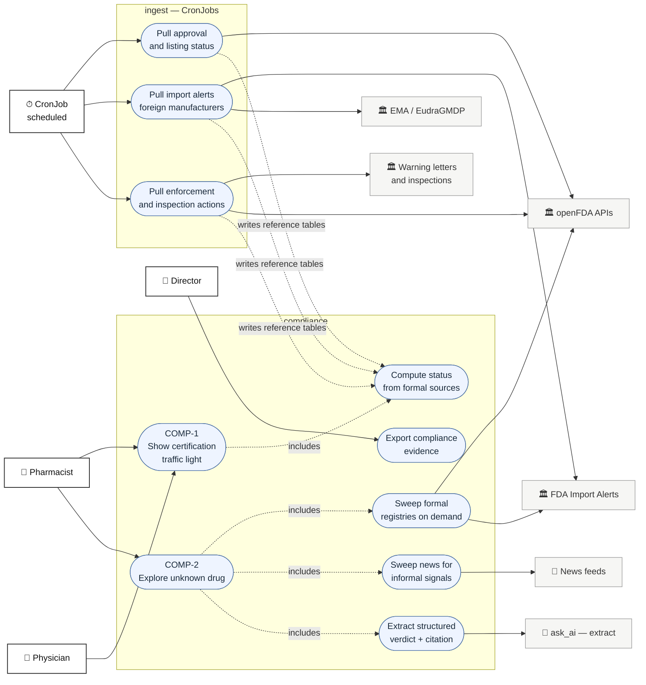
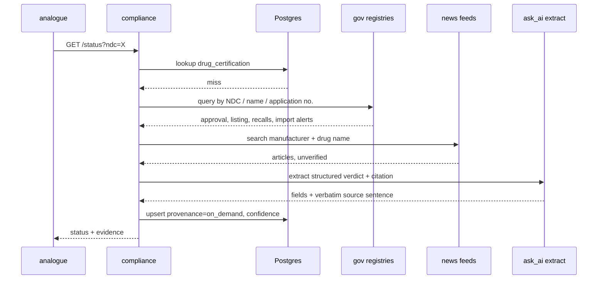

# `compliance` — Use Cases

Companion to [services.md](services.md) §3. Scope: the two use cases owned by `compliance`.

Status: **draft** — items marked `OPEN` change the architecture in [services.md](services.md)
and are not settled. Feed URLs marked `verify` follow the same convention as
`services/ingest` — placeholder until checked against a live response.

---

## 0. The two cases in one line each

| | Case | Trigger | Output |
|---|---|---|---|
| **COMP-1** | Certification traffic light | A pharmacist opens inventory | Green / Yellow / Red badge per stocked drug |
| **COMP-2** | Unknown-drug exploration | Analogue search returns a drug not in our certification table | A provisional certification record + citation |

COMP-1 is a scheduled read of formal government data. COMP-2 is an on-demand reach into the same
sources plus news, for a drug nobody has asked about before.

---

## 1. Use case diagram



The dotted `includes` edges are UML `<<include>>`. The dotted edges from `ingest` to `COMP-1A`
are **not** calls — `ingest` writes reference tables and `compliance` reads them. There is no
HTTP between them, consistent with [services.md](services.md) §1.1.

---

## 2. COMP-1 — the traffic light

### 2.1 Status rule

Evaluated per NDC, highest severity wins. **Red requires a formal government source.** News can
never produce Red — see §4.3.

| Status | Condition | Source |
|---|---|---|
| 🔴 **Red** | `marketing_end_date` in the past, or listing expired | NDC Directory |
| 🔴 | Application withdrawn or approval revoked | Drugs@FDA |
| 🔴 | Class I recall, status `ongoing` | Enforcement |
| 🔴 | Manufacturer on an import alert red list (DWPE) | Import Alerts |
| 🟡 **Yellow** | `marketing_end_date` within 90 days | NDC Directory |
| 🟡 | Class II or III recall, status `ongoing` | Enforcement |
| 🟡 | Open warning letter, or inspection classified OAI, against the labeler | Warning letters / ICD |
| 🟡 | GMP non-compliance statement for a foreign site | EudraGMDP |
| 🟡 | Informal signal above threshold | News (COMP-2B) |
| 🟢 **Green** | Present, marketing status active, none of the above | — |
| ⚪ **Unknown** | NDC not in the certification table | triggers COMP-2 |

The 90-day Yellow window is a constant, not a judgement call baked into a query — one place,
one number to defend.

### 2.2 Where the badge comes from

`compliance` owns the status. The inventory **page** shows it, but `inventory` the service is
not involved:

```
browser ──▶ /api/inventory/stock       ──▶ inventory   (what is on the shelf)
       └──▶ /api/compliance/status?ndc= ──▶ compliance  (what colour it is)
```

Two same-origin calls from one page, joined in the browser. This follows
[services.md](services.md) §2 — the browser calls the seven services directly — and avoids
making `compliance` an availability dependency of the stock list. If `compliance` is down the
shelf still renders; the badges go grey.

`OPEN` — the alternative is a SQL join inside `inventory`, which is cheaper for the client and
legitimate under the shared-schema design, but puts compliance logic in someone else's service.
Recommendation: two calls. Decide before the endpoint is written.

### 2.3 Endpoints

| Method | Path | Permission | Status | Notes |
|---|---|---|---|---|
| `GET` | `/status?ndc=…` | `certificate:read` | **built** | Batch: repeatable `ndc` param, max 100, one page of stock in one call |
| `GET` | `/certificates/{ndc}` | `certificate:read` | **built** | Full evidence — every finding behind the colour, with source URLs |
| `GET` | `/ruleset` | `inventory:read` | **built** | Every rule and threshold that can produce a colour |
| `POST` | `/explore` | `certification:explore` | **built** | COMP-2 on demand, max 10 NDCs — two upstream calls each |
| `GET` | `/audit` | `audit:read` | **built** (H1) | Pharmacist, director, admin. Empty until a `review_decision` is written |
| `GET` | `/export/compliance.csv` | planned (`audit:export` or director role) | planned | Do not reuse `audit:read` alone — pharmacist holds that for the page |

`certificate:read` is held by pharmacist, physician and director — every role that can see the
shelf can see the badge on it. `certification:explore` is narrower (pharmacist only) because it
spends the shared openFDA daily budget, and `/ruleset` sits on `inventory:read` because it is
the same document for everyone and contains nothing about a particular drug.

The status rules live in `shared/medstock_shared/certification.py`, the daily feed in
`services/ingest/app/certification.py`.

### 2.4 Clicking the light

The badge is a button. The colour is a verdict, and a verdict you cannot interrogate is one a
pharmacist is right to distrust — so the evidence is one click from the light itself rather
than behind a row menu.

What the dialog says depends on the colour, and **green gets a sentence like every other
state**. That is the point of the section. An empty findings list renders identically to
"nobody looked", and those are opposite facts:

| Colour | What it says |
|---|---|
| Green | *N* rules evaluated, none disqualifying, broken down by category — plus the limit: green is a statement about the FDA record, not an inspection of the physical stock |
| Amber / Red | The finding that **set the colour**, tagged as such in the list so severity ordering is not a puzzle to solve, and whether the reasons are standing or have an end |
| Unknown | No record held. Explicitly *not* a clean bill of health; opening the dialog is what asks the FDA (COMP-2) |
| Unavailable | The service could not be reached. Nothing was checked — never rendered as green |

The wording lives in `web/lib/certification.ts`, apart from the dialog, because the copilot
drawer shows the same verdict and two copies would eventually disagree about what green means
on the same screen.

### 2.5 The gates

One word on a badge is five questions collapsed into one. That is the right default for a
shelf — eleven drugs cannot show forty findings — but it means "Attention" cannot be told from
"Attention" without opening the list and inferring the difference from the codes.

So the dialog shows the gates themselves, in pipeline order rather than alphabetically:

| Gate | Asks |
|---|---|
| `lifecycle` | Is it still a marketed product? |
| `approval` | What authority is it sold under? |
| `enforcement` | Recalls and regulatory action |
| `supply` | Can it actually be obtained? |
| `data` | What could we not check? |

Each shows *n/total* rules fired and a word — `pass`, `flagged`, `failed`, `not run`. The word
carries the verdict, not the dot: green and red sit next to each other here, which is the one
pair a red/green reader cannot separate.

**`not run` is not `pass`.** An `unknown` or `unavailable` badge renders every gate grey. A row
of green gates over a grey badge would be the most misleading thing on the page — it would
claim five checks cleared for a drug nobody looked at.

An `info` finding does not fail its gate. It is a note about what could not be checked, not a
reason to hold the drug — which is why `data` can read `pass · 1/3`.

### 2.6 Re-checking one drug

`Re-check now`, in the certificate dialog, calls `POST /explore` for that NDC and reloads the
verdict. Unlike opening the dialog — which explores only on a miss or an expired row — this
re-fetches unconditionally. That is the point: a pharmacist who has just read a recall notice
should not have to wait out the seven-day TTL to see it reflected.

It costs two upstream calls against a shared daily budget, so it is a deliberate click rather
than something the dialog does on open, and it is offered only to roles holding
`certification:explore` (pharmacist, admin). When the role cannot be confirmed the button is
still offered and the server decides — same reasoning as `approvalStance` in
[prognosis-and-procurement.md](prognosis-and-procurement.md) §5.4: gating a control on auth
being reachable puts auth back in the critical path of a page built not to need it.

A failure leaves the previous verdict on screen under an error toast. Blanking it would imply
the drug had become unknown when nothing about it changed.

> `POST /explore` answers **200 with an `errors` entry** when an upstream lookup fails, because
> it is built for batches where one dead lookup must not lose the answers that did come back.
> A caller passing a single NDC has to check that map, or a failed re-check reads as success
> and the dialog redisplays the stale verdict as though it were fresh.

---

## 3. COMP-2 — exploring a drug we have never seen

Triggered when `analogue` surfaces a candidate whose NDC has no row in `drug_certification`.



### 3.1 Rules that keep this honest

1. **Provenance is stored.** Every row records whether it came from a scheduled formal pull
   (`scheduled`) or an on-demand exploration (`on_demand`), and which source produced each
   finding. A Director export that cannot say where a colour came from is not evidence.
2. **A citation must be a verbatim substring of the fetched source text** — the same validator
   rule [services.md](services.md) §6 already applies to `analogue`. A hallucinated citation
   fails validation before it is cached.
3. **On-demand results expire.** A `scheduled` row is refreshed by its CronJob; an `on_demand`
   row has no schedule behind it, so it carries a TTL (proposed: 7 days) after which the next
   lookup re-explores.
4. **Budget.** openFDA is 1 000 requests/day *per IP* ([services.md](services.md) §7) and COMP-2
   spends from the same budget as the CronJobs. On-demand exploration is capped per hour and
   falls back to ⚪ Unknown rather than starving the scheduled pulls.

---

## 4. Data sources

`verify` = URL and field names are a placeholder, not yet checked against a live response —
same convention as `services/ingest`. Do not schedule anything marked `verify`.

### 4.1 Government — formal, can produce Red

| Source | Endpoint | Key | Gives us | Cadence |
|---|---|---|---|---|
| **openFDA NDC Directory** | `api.fda.gov/drug/ndc.json` | none | `marketing_start_date`, `marketing_end_date`, `listing_expiration_date`, `marketing_category`, labeler | daily |
| **openFDA Drugs@FDA** | `api.fda.gov/drug/drugsfda.json` | none | NDA/ANDA application, approval date, submission status — "is it approved at all" | weekly |
| **openFDA Enforcement** | `api.fda.gov/drug/enforcement.json` | none | Recall class I/II/III, `status` ongoing/terminated, reason text | daily |
| **openFDA Drug Label** | `api.fda.gov/drug/label.json` | none | SPL text — the input to `extract` in COMP-2 | on demand |
| **FDA Import Alerts (DWPE)** | `accessdata.fda.gov/cms_ia/ialist.html` — alerts **66-40** (GMP failure) and **66-41** (unapproved drugs) | none | **The import-certification source.** Foreign manufacturers detained without physical examination | weekly · `verify` |
| **FDA Warning Letters** | `…/warning-letters/datatables-data` — an **XLSX export**, not JSON | none | A letter issued to a labeler. **Not** whether it is still open — see below | weekly · **built** |
| **FDA Inspection Classification** | FDA inspections dataset export | none | OAI / VAI / NAI per site — OAI is the Yellow signal | monthly · `verify` |
| **FDA Drug Establishment Registration** | DECRS export | none | Is the foreign establishment registered at all | monthly · `verify` |
| **EMA / EudraGMDP** | EudraGMDP portal | none | GMP certificates and **non-compliance statements** for non-US sites | monthly · `verify` |

Only the four openFDA rows are true JSON APIs. Import alerts, warning letters, inspections and
EudraGMDP are HTML or file exports — they need parsing, and they are the fragile part of this
design. That fragility is the cost of covering *import* certification at all, which no JSON API
exposes.

### 4.2 News — informal, can only produce Yellow

| Source | Endpoint | Key | Notes |
|---|---|---|---|
| **FDA press announcements / MedWatch** | FDA RSS feeds | none | Official but faster than the datasets — the best signal here |
| **GDELT Doc API** | `api.gdeltproject.org/api/v2/doc/doc` | none | Global news index, keyless, filterable by domain and date. Recommended default — but see below |
| **Google News RSS** | `news.google.com/rss/search?q=` | none | Trivial to query, no quota published — treat as best-effort. **The fallback that actually ran** |
| **NewsAPI.org** | `newsapi.org/v2/everything` | **yes** | Free dev tier is non-commercial and rate-limited. Only if GDELT proves insufficient |
| **Trade press** (Regulatory Focus, FiercePharma, Endpoints) | RSS | none | Narrow, high-signal. Pink Sheet is paywalled — excluded |

`services/ingest/app/news.py` tries GDELT first and falls back to Google News RSS. **GDELT
answered 429 to every query from the development network** — including a bare `query=heparin`
with a browser user agent, so it is neither pacing nor the user agent — while openFDA, CPIC and
accessdata.fda.gov all worked from the same host. A compliance feed that silently produces
nothing because one index is unreachable is worse than a best-effort second source the design
already sanctions, so both are wired and whichever answers is used. The severity is identical
either way.

One trap in the fallback: **Google News RSS ignores date qualifiers**, and will return a 2017
story about contaminated heparin next to this month's. The window is applied after the fetch, or
a nine-year-old article would be presented as a current signal.

### 4.3 Why news cannot turn a badge red

A news article is an unverified claim about a third party. Acting on it as fact means the
system can tell a pharmacist a drug is uncertified because a blog said so. The rule is
therefore structural, not a preference: **news raises Yellow and attaches the article; only a
government source sets Red.** Yellow means "check this", which is exactly what an unconfirmed
report warrants.

---

## 5. Schema sketch

Reference class ([services.md](services.md) §1.1) — global, no `hospital_id`, no RLS. FDA
certification is identical for every hospital, so it is polled once for all of them.

| Table | Written by | Key columns |
|---|---|---|
| `drug_certification` | `ingest` (scheduled) + `compliance` (on-demand) | `ndc` unique · `status` · `marketing_end_date` · `approval_status` · `provenance` · `confidence` · `expires_at` · `raw` |
| `certification_finding` | same | `ndc` · `severity` · `source` · `source_url` · `citation` · `observed_at` · `raw` |
| `import_alert` | `ingest` | `alert_number` · `firm_name` · **`firm_key`** · `country` · `address` · `listed_at` unique on (`alert_number`, `firm_name`) — **built** |
| `news_signal` | `ingest` | `ndc` · `query_term` · `headline` · `url` · `domain` · `published_at` unique on `url` — **built** |

`firm_key` is the normalised name the labeler match runs on, stored rather than derived on read
so it is indexable and so the normalisation can be inspected when a match is disputed.

**The match is exact and never fuzzy**, and that asymmetry is deliberate: a missed alert looks
like every other drug that is not on one, while a false match publicly accuses a named
manufacturer of being detained at the border over a product that has nothing to do with them.
Those errors are not symmetric, so the matcher errs hard toward missing and the finding names the
matched firm so a human can check it. Corporate suffixes are stripped (`N.V.` ≡ `NV`); nothing
else is.

Both feeds raise **yellow only**. For news that is §4.3. For import alerts it is because
detention without physical examination is a standing posture on a *manufacturer*, not a defect
found in this product — the finding says "check where this came from", which is what yellow
means. `news_signal` is written by `ingest` rather than `compliance` as originally sketched: it
is a scheduled feed like every other, and putting it on a request path would make a badge wait
on a news index.

One row per NDC in `drug_certification` holds the computed colour; `certification_finding` holds
every reason behind it. The colour is derived and re-derivable — if the rule in §2.1 changes,
findings are replayed, not re-fetched.

---

## 6. `OPEN` — decisions this design needs before code

1. **`compliance` would call Gemini.** [services.md](services.md) §3 states plainly that *only*
   `analogue` and `prediction` call `ask_ai()`. COMP-2C breaks that. The `extract` task is already
   assigned to this service's owner in §4's task table, so the intent seems to have been there —
   but the rule as written says no. Either §3 gets amended to three AI consumers, or COMP-2C is
   dropped and unknown drugs stay ⚪ until a CronJob catches them. **Recommendation:** amend §3.
   The alternative makes COMP-2 a scheduled feature, which is not what it is for.

   **Resolved by not happening.** COMP-2 shipped without AI: `explore.py` resolves an unknown NDC
   against the openFDA directory and RxNorm's NDC status endpoint, and no `ask_ai()` call exists
   anywhere in `compliance`. The rule in §3 is intact for this service, and §3 has since been
   amended only for `ingest`'s offline CronJobs.

   Note that [prognosis-and-procurement.md](prognosis-and-procurement.md) §6 still cites recall
   identity extraction as one of the two places AI is load-bearing, and **that extraction does not
   exist**. Reviving it is a live decision, not a settled one: the measured 40% regex ceiling is
   the argument for it, and this item is the argument against doing it on a request path.
2. ~~**Two new ingest CronJobs**~~ **Done.** `ingest-certification` (daily),
   `ingest-import-alerts` (Mondays 04:00) and `ingest-news` (daily 06:30) are in
   `deploy/k8s/ingest-cronjobs.yaml`, which now carries seven jobs.
3. ~~**HTML scraping enters the codebase**~~ **Accepted and done**, for import alerts.
   `services/ingest/app/import_alerts.py`, and the source is now verified rather than `verify`:

   - `ialist.html` carries the alert number and its detail page in sibling `<td>`s, so the
     mapping is read rather than hardcoded — the page ids are internal and have already drifted
     (66-40 is `importalert_189.html`, not `_190`).
   - The detail pages contain **no `<table>` at all** despite being ~2 MB. Firms are
     `<div class="div-name floatleft">` blocks: **453 on 66-40, 1 832 on 66-41**, live.
   - The country is the trailing run of capitals, not the last comma-separated field — that
     naive read yields "AM-KT ARMENIA" and inflates 55 countries into 529.

   The fragility is real and handled by failing loudly: a layout change produces zero firms and
   says so, rather than wrong ones. `--dry-run` shows what the parser found before anything is
   written.

   **Warning letters are built too**, and verifying the source changed the design twice. The
   listing posts to a `datatables-data` endpoint that answers with an XLSX workbook despite the
   URL, which is sturdier than the rendered table and needs no Excel dependency — the sheet is
   flat, so `zipfile` plus shared strings is enough.

   More important: **the export cannot say whether an action is open.** It carries a
   `Closeout Letter` column that is empty on all 1 000 rows, while `Response Letter` is populated
   on 128 — the closeout hyperlink does not survive the export. So the finding says a letter *was
   issued*, names the firm, date and subject, and states that closeout status is not published.
   Claiming an open investigation from a source that does not publish closure would be the one
   dishonest finding in the module, and a test asserts the words never appear.

   The endpoint caps at 1 000 rows however it is paged, but they are recent (newest 2026-04-09 on
   the last run, 219 of 989 from CDER), and anything older than three years is dropped at finding
   time anyway.

   EudraGMDP and inspection classifications remain unscraped.
4. **Two calls vs. a SQL join** for the inventory badge — §2.2.
5. ~~**New permissions.**~~ **Done.** `certificate:read` and `certification:explore` are in
   `shared/medstock_shared/auth.py`, and `/status`, `/certificates/{ndc}` and `/explore` are on
   them instead of `inventory:read`.

   The split is not about secrecy. `/explore` triggers a live openFDA fetch and openFDA's budget
   is 1 000 requests a day *per IP, shared across every feed* ([services.md](services.md) §7), so
   a permission that let anyone who can see stock spend it would let one curious user starve the
   nightly CronJobs. Reading an already-computed certificate costs a SQL query and is granted to
   pharmacist, physician, director and admin; exploring is pharmacist and admin only.
