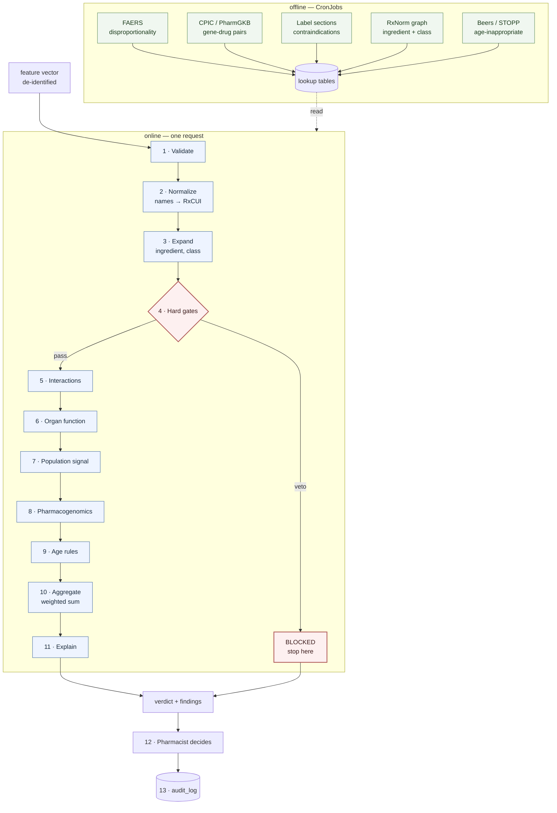
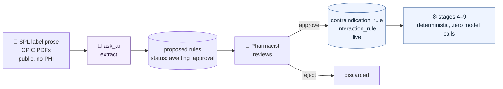

# `patient-profiling` — Processing Pipeline

Deterministic, multi-stage. No trained model on the request path. Every output is a rule that
fired, with a weight and a source. If you can't point at the rule, it didn't happen.

---

## 0. The shape

Two halves, and keeping them apart is the whole design:

- **Offline** — CronJobs build lookup tables from public data. Slow, batched, allowed to fail.
- **Online** — the request does table lookups and arithmetic. No network calls, no model, no
  surprises. Target: under 200 ms.

Everything expensive happens before the pharmacist ever clicks.



---

## 1. Input contract

One object. If a field is missing the pipeline degrades — it does not guess.

```json
{
  "request_id": "uuid",
  "candidate_rxcui": "1049640",
  "current_rxcuis": ["855332", "310798"],
  "age_band": "75-89",
  "sex": "F",
  "weight_kg_band": "60-79",
  "egfr_band": "30-44",
  "hepatic": "normal | impaired | unknown",
  "allergy_codes": ["N0000175503"],
  "condition_codes": ["I48.0", "N18.3"],
  "prior_adr": [{"rxcui": "855332", "reaction": "angioedema"}],
  "pgx_alleles": {"CYP2C19": "*2/*2"},
  "ruleset_version": "2026.08.1"
}
```

`unknown` is a first-class value. An unknown eGFR does not mean normal eGFR — it means stage 6
emits an `INFO` finding saying it couldn't check, and that finding appears in the output. Silence
is never treated as safety.

---

## 2. The stages

| # | Stage | Does | Emits | If it fails |
|---|---|---|---|---|
| 1 | **Validate** | Schema check, required fields, enum values | — | `422`, nothing runs |
| 2 | **Normalize** | Drug strings → RxCUI, allergy strings → codes, conditions → ICD-10 | — | Unresolvable code becomes `INFO: unrecognized`, pipeline continues |
| 3 | **Expand** | RxCUI → ingredient, ATC class, EPC class via `rxnorm_edge` | — | `INFO`, later class rules skipped |
| 4 | **Hard gates** | Allergy match incl. class cross-reactivity · label absolute contraindication · duplicate active ingredient · pregnancy contraindication | `BLOCK` | Table missing → `HIGH` not silent pass |
| 5 | **Interactions** | Candidate × every current drug, pairwise | `HIGH` / `MODERATE` | `HIGH: unchecked` |
| 6 | **Organ function** | eGFR band vs renal-cleared drug thresholds; hepatic vs metabolised drugs | `HIGH` / `MODERATE` | `INFO: unknown` |
| 7 | **Population signal** | Precomputed FAERS PRR/ROR for this drug × serious reaction | `MODERATE` / `LOW` | skip, `INFO` |
| 8 | **Pharmacogenomics** | CPIC level A/B lookup on supplied alleles | `HIGH` / `MODERATE` | skip if no alleles, no finding |
| 9 | **Age rules** | Beers / STOPP if `age_band` ≥ 65 | `MODERATE` | skip |
| 10 | **Aggregate** | Weighted sum → band | verdict | — |
| 11 | **Explain** | Sort findings by weight, attach citations and source URLs | text | — |
| 12 | **HITL** | Pharmacist approves / rejects / overrides | decision | — |
| 13 | **Audit** | Trigger writes `audit_log_entry` | row | — |

**Stage 4 short-circuits.** A hard gate ends the pipeline — no score is computed, because a
number next to an absolute contraindication invites someone to weigh it against something else.

---

## 3. Findings

Every stage speaks one language:

```python
@dataclass(frozen=True)
class Finding:
    code: str          # "INTERACTION_MAJOR"
    severity: str      # BLOCK | HIGH | MODERATE | LOW | INFO
    weight: int        # 0 for INFO
    message: str       # "Warfarin + fluconazole: bleeding risk"
    source: str        # "CPIC 2022" | "FAERS 2026-07" | "SPL contraindications"
    source_url: str
    stage: int
```

The findings list *is* the explanation. Stage 11 sorts it — it doesn't invent prose.

---

## 4. Scoring

```python
BANDS = [(0, "GREEN"), (30, "AMBER"), (60, "RED")]

def aggregate(findings):
    if any(f.severity == "BLOCK" for f in findings):
        return Verdict("BLOCKED", None, findings)
    score = sum(f.weight for f in findings)
    band  = next(b for t, b in reversed(BANDS) if score >= t)
    return Verdict(band, score, findings)
```

Fixed weights, tuned by hand, versioned:

| Finding | Weight |
|---|---|
| Prior ADR to same ingredient or class | 45 |
| Interaction, major | 40 |
| PGx poor/ultrarapid metabolizer, CPIC level A | 35 |
| Renal dose limit exceeded for band | 30 |
| Duplicate therapeutic class | 25 |
| Hepatic impairment + hepatically cleared | 20 |
| FAERS PRR ≥ 5, serious reaction | 20 |
| Beers/STOPP hit, age ≥ 65 | 20 |
| Interaction, moderate | 15 |
| FAERS PRR 2–5 | 10 |
| Narrow therapeutic index drug | 10 |
| Anything `INFO` | 0 |

Two moderate findings (30) reach AMBER. That's intentional — the thresholds encode "one concern
is noise, two is a pattern." Change the numbers, bump `ruleset_version`, and every stored
assessment still explains itself because the version it ran under is recorded.

**This table is the product's clinical opinion.** It should be reviewed by a pharmacist, not an
engineer. Write it in one file, not scattered across the stages.

---

## 5. The offline jobs

| Job | Cadence | Builds | From |
|---|---|---|---|
| `pgx` | monthly | `pgx_guideline` | CPIC guideline downloads |
| `interactions` | monthly | `interaction_rule` | Label interaction sections + OFFSIDES/TWOSIDES |
| `adr_signal` | weekly | `adr_signal` (PRR/ROR) | openFDA FAERS, aggregated |
| `label_rules` | weekly | `contraindication_rule` | openFDA SPL — contraindications, warnings |
| `rxnorm_graph` | weekly | `rxnorm_edge` | RxNorm — already exists in `ingest` |

Same rules as the existing CronJobs: upsert on a natural key, safe to run twice.

PRR is the only statistics in the system, and it's computed offline:

```
PRR = (a/(a+b)) / (c/(c+d))
      a = reports of reaction R with drug D      b = other reactions with D
      c = reports of R with all other drugs      d = other reactions, other drugs
```

Signal when `PRR ≥ 2`, `a ≥ 3`, and chi-square ≥ 4. Three lines of SQL over a materialized
FAERS table. No training, no model file, no drift.

---

## 6. Failure behavior

Fail loud, never fail silent:

1. **A missing table degrades the verdict, it doesn't improve it.** If interactions can't be
   checked, that's a `HIGH` finding, not an absent one.
2. **Stage 4 tables missing = the pipeline refuses.** Hard gates are not optional; if they can't
   run, return `503`. Better no answer than a green light from a stage that didn't execute.
3. **Every response lists what ran.** `stages_completed: [1,2,3,4,5,6,9]` — the pharmacist sees
   that PGx and FAERS were skipped, rather than assuming clean.

---

## 7. Caching

Deterministic input plus fixed ruleset means the same vector always yields the same verdict.

```
cache_key = sha256(canonical_json(vector) + ruleset_version)
```

Cache in a tenant table under RLS — not in `ai_cache`, which is global. Nothing here goes near
Gemini, so the reasons in `patient-profiling-usecases.md` §2.1 don't apply, but the isolation
rule still does.

Bump `ruleset_version` and every entry is invalidated for free — no eviction logic.

---

## 8. Endpoints

| Method | Path | Permission |
|---|---|---|
| `POST` | `/assess` | `profile:assess` |
| `GET` | `/assess/{request_id}` | `profile:assess` |
| `GET` | `/assess/{request_id}/explain` | `profile:explain` |
| `POST` | `/assess/{request_id}/decision` | `recommendation:approve` |
| `GET` | `/ruleset` | `profile:assess` |

`GET /ruleset` returns the weight table and version. A tool that won't show you its rules is a
tool a pharmacist is right to distrust.

---

## 9. Where the AI is

Nothing above §8 calls a model. That is correct for the request path and wrong as a whole
answer — so here is the placement, stated as a rule:

> **AI turns unstructured text into structure. A human approves the structure once. The runtime
> reads the structure and never calls a model.**

This is the same pattern the product brief already argues for connectors: the model builds the
spec at integration time, a human confirms it, and everything downstream runs deterministically
with zero model calls. Applied here:



### 9.1 The three candidate placements

| Where | What the model does | Verdict |
|---|---|---|
| **Offline rule extraction** (§5) | Reads label prose — *"contraindicated in severe renal impairment (CrCl < 30 mL/min)"* — and emits `{stage: 6, field: egfr, op: "<", value: 30, severity: HIGH}` with the source sentence quoted | **Yes. This is the placement.** |
| **Stage 11 explain** | Turns the sorted `Finding` list into a paragraph a pharmacist reads | Optional. Grounded strictly on findings, no new facts |
| **Stage 2 normalize** | Free-text allergies and drug names → codes | **No — see §9.3** |
| **Stage 10 scoring** | Produce the risk number | **Never.** Not tunable, not reproducible, not defensible |

### 9.2 Why rule extraction is real AI work

There are tens of thousands of SPL labels. The contraindication and interaction sections are
prose written for humans, with no fixed grammar:

- *"Avoid concomitant use with strong CYP3A4 inhibitors."*
- *"Not recommended in patients with a creatinine clearance below 30 mL/min."*
- *"Use with caution in hepatic impairment; consider dose reduction."*

A regex does not get these. A pharmacist hand-coding them does not scale past a few hundred
drugs. This is extraction over unstructured clinical text at volume — exactly the `extract` task
already assigned in [services.md](services.md) §4, and exactly the argument the product brief
makes for why AI is needed rather than decorative.

Three properties make it safe:

1. **Public data only.** SPL labels and CPIC guidelines. No patient ever reaches the model, so
   the `ai_cache` and BAA problems in
   [patient-profiling-usecases.md](patient-profiling-usecases.md) §2.1 do not arise here.
2. **The cache works perfectly.** The same label yields the same rules — one extraction per
   label, ever, shared across all hospitals. `ai_cache` was built for this.
3. **A human gate before anything goes live.** Rules land `awaiting_approval`. A rejected rule
   never touches a patient. Same HITL guarantee as a substitution.

Every extracted rule carries the verbatim source sentence, validated as a substring of the label
text — the citation rule from [services.md](services.md) §6. A rule whose quote isn't in the
source is dropped before a pharmacist ever sees it.

### 9.3 Why not stage 2

Normalizing free-text allergies would mean patient text reaching a model — which contradicts the
no-PHI recommendation and the global `ai_cache`. Under that design the hospital de-identifies at
the edge and sends codes, so there is no free text on our side to extract from. If a hospital
ever hands us raw text, that extraction runs on their infrastructure, not ours.

### 9.4 So how much AI does the project have

`analogue` ranks alternatives with citations, `prediction` forecasts, `compliance` explores
unknown drugs (UC-2), and `patient-profiling` extracts rules from labels. Four services, one
`ask_ai()`, one cache. `patient-profiling` does not need a model in its request path to make the
project an AI project — and the request path is the one place where determinism is worth more
than intelligence.

---

## 10. Where ML could go later

Nowhere on the request path, and nothing above changes if it never arrives:

- Replace hand-tuned weights with fitted coefficients — same `Finding` list, same output shape.
- Add stages 14+ as new rules; the aggregator doesn't know how many there are.
- Swap the FAERS threshold for a Bayesian shrinkage estimate (BCPNN) — still offline, still a
  table.

The pipeline is built so the model is an upgrade to stage 10, not a rewrite.
