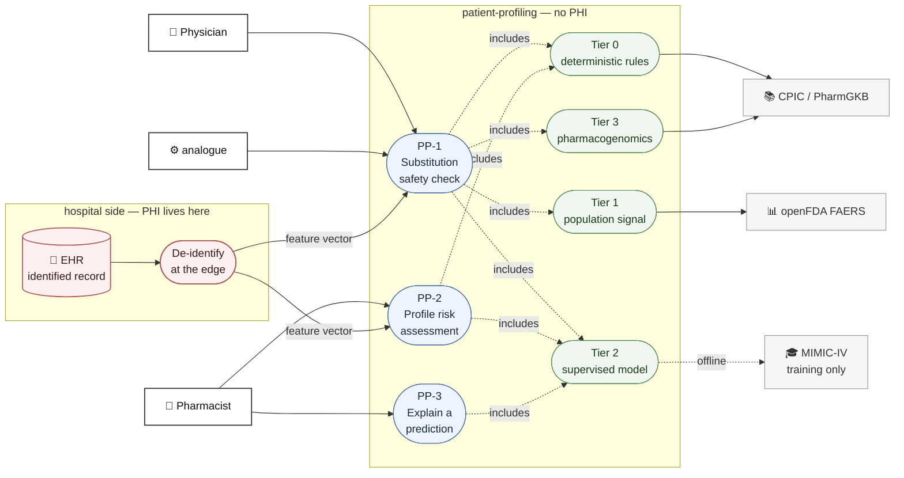

# `patient-profiling` — Use Cases and the PHI Decision

Companion to [services.md](services.md) §3 and open item #5. Scope: adverse-reaction risk
prediction, and the data-protection decision that has to be made before any schema is written.

Status: **draft**. §2 is a recommendation, not a settled decision.

> Not legal advice. The architecture below is designed so that the legal question stays small,
> but "we store no PHI" is a claim a compliance officer has to sign, not an engineer.

---

## 0. The cases

| | Case | Trigger | Output |
|---|---|---|---|
| **PP-1** | Substitution safety check | `analogue` proposes an alternative drug | Risk score + ranked reasons + hard blocks |
| **PP-2** | Profile risk assessment | Pharmacist opens a patient's assessment | Per-drug risk across the current regimen |
| **PP-3** | Explain a prediction | Pharmacist asks "why?" | Feature contributions + guideline citations — **built**, `GET /explain/{request_id}` |

PP-3 is not a nice-to-have. It is what keeps this system a decision *support* tool rather than a
regulated medical device (§6), and what satisfies the human-in-the-loop requirement the product
brief already commits to.

---

## 1. Use case diagram



The red box is the trust boundary. Everything inside `patient-profiling` receives a feature
vector and never learns whose it is.

---

## 2. The decision: can a web interface be trusted with patient data?

**Recommendation: our system stores no PHI. Ever.** The browser sends a de-identified feature
vector, the answer comes back, nothing about the patient is persisted.

### 2.1 Why the question is really about persistence, not the browser

A web interface *can* be trusted with PHI — every EHR on earth is one. TLS, `httpOnly` +
`Secure` + `SameSite` cookies, short sessions, no identifiers in URLs, no PHI in logs or
analytics. The existing design already has most of that ([services.md](services.md) §2), and the
"never put personal data in query strings" rule is already written down.

So the browser is not the weak point. **These three are:**

| # | Problem | Severity |
|---|---|---|
| 1 | `ai_cache` is global — no `hospital_id`, no RLS, shared across all hospitals **by design** | Fatal |
| 2 | `ask_ai()` reaches Gemini through `genai.Client(api_key=…)` — the Developer API, which Google does **not** cover by a BAA | Fatal |
| 3 | A real HIPAA program is not a sprint — risk analysis, workforce training, breach notification, BAAs with every subprocessor | Out of scope |

Problem 1 is the one to say out loud at defense. `shared/medstock_shared/models.py` documents
the cache as safe *because* "the payload behind `dedupe_key` is reference data … never PHI."
Put a patient into `ask_ai()` and that sentence becomes false, and hospital B can read hospital
A's patient data out of a shared cache. It would not be a bug in the cache — the cache is
working exactly as specified. It would be a design error upstream.

Problem 2 is concrete and checkable: `shared/medstock_shared/ai.py:28`. Google's HIPAA-covered
product list includes **Vertex AI**, not the Gemini Developer API. Same model, different
contract. If PHI ever had to reach a model, that line has to change first.

### 2.2 What "de-identified" has to mean

HIPAA Safe Harbor (45 CFR §164.514(b)(2)) — strip all 18 identifier classes. The ones that bite
here:

- No name, MRN, SSN, contact details, device or account identifiers
- **No dates finer than year** — no DOB, no admission date. Use *days since* offsets
- **Ages over 89 collapse to "90+"** — an easy one to miss
- No geography below state level
- No re-identification code we can resolve. If the hospital keeps the map and we hold a token,
  that is a **limited data set** under §164.514(e) — still PHI, still needs a DUA. Do not
  confuse the two.

### 2.3 What the model actually needs

Nothing that was stripped. The prediction runs on a **feature vector, not a person**:

```
age_band, sex, weight_band, eGFR_band, hepatic_function,
allergy_codes[], comorbidity_codes[], active_rxcuis[],
prior_adr_codes[], relevant_lab_bands[], pgx_phenotypes[]
```

**`pgx_phenotypes`, not `pgx_alleles`** — changed when Tier 3 was built, and worth the
sentence. Turning a diplotype like `*2/*2` into "Poor Metabolizer" needs CPIC's
allele-definition and diplotype tables, and a mis-mapped diplotype is a clinical error we
would have authored. The reporting lab already states the phenotype, every CPIC
recommendation is keyed on it, and taking what the lab asserts keeps the accountability for
that inference where it already sits. Values are `"GENE:phenotype"` in CPIC's own
vocabulary — `"CYP2C19:Poor Metabolizer"`, `"HLA-B:*57:01 positive"`.

De-identification is not a compromise here — it is sufficient. That is what makes this
recommendation cheap rather than a sacrifice.

### 2.4 Consequences, stated plainly

- **No longitudinal history.** Same patient tomorrow = a new vector. Trend features must be
  computed hospital-side and passed in as inputs.
- **The audit log records the decision, not the patient.** A pharmacist's approval is logged
  against a request id and the clinician's identity, not the person's. Under
  [services.md](services.md) §1.3 that is still a complete decision trail — it just does not
  answer "which patient". The hospital's own EHR answers that.
- **De-identification becomes the hospital's job.** We publish the contract for the vector and
  refuse anything else. `OPEN` — this needs an integration story per hospital, and it is the
  real cost of this recommendation.

### 2.5 The alternative, if PHI is required

If the assessment turns out to need identity, the change is not incremental:
`patient_*` tables become tenant class with RLS, `ask_ai()` moves to Vertex AI under a BAA
*or* patient-profiling is barred from AI entirely, `ai_cache` gets a `hospital_id` or is bypassed
on this path, plus encryption at rest with CMEK, key rotation, access review, and a signed BAA
with the cloud provider. **That is a semester of compliance work, not a feature.** Choose it
deliberately or not at all.

---

## 3. The ML design

"Predict patient reactions" is four different problems. Separating them is what makes it
buildable — and only Tier 2 is the black box.

| Tier | Method | Answers | Data | Explainable? |
|---|---|---|---|---|
| **0** | Deterministic rules | Hard contraindications, allergy cross-reactivity (β-lactam class), renal/hepatic dose limits, duplicate therapy | Knowledge bases | Trivially |
| **1** | Disproportionality analysis — PRR / ROR / IC | "This reaction is reported N× above baseline for this drug" | FAERS | Yes — it is a ratio |

**Tier 1 is built** (`services/ingest/app/faers.py` → `adr_signal` → stage 7a). PRR and ROR from
the standard 2×2 table, screened on the conventional floors: at least 3 reports and PRR ≥ 2.

Three things measured while building it:

- **The keyless baseline is the top 100 reactions, not 1 000.** Asking a count query for
  `limit=1000` returns `403 API_KEY_MISSING`. Every other feed here is keyless by design, so 100
  is what ships — and it is a real coverage limit, because a drug-specific reaction outside the
  overall top 100 has no baseline and is skipped rather than given a guessed one. Metformin's
  lactic acidosis is one such casualty; it is caught by Tier 3's label extraction instead.
  Registering an openFDA key would raise the ceiling and materially widen this tier.
- **Confounding by indication is visible in the output, not theoretical.** Metformin's strongest
  signal is *blood glucose increased* at PRR 4.6 over 8 659 reports. Metformin does not raise
  blood glucose; it is prescribed to people whose glucose is already high. This is why the tier
  carries a small weight and why every message it emits says "reported", never "causes".
- **openFDA answers 404 for "no matching reports"**, which for a drug nobody has filed an event
  against is an ordinary result rather than an error.

The weight is deliberately the smallest in the table. A FAERS ratio is identical for every
patient on the drug, so if it could outweigh a renal or prior-ADR finding it would flatten the
distinctions the assessment exists to make. It nudges; it does not decide.
| **2** | Gradient boosting or survival model | Individual risk score for a named reaction | MIMIC-IV, offline | Via SHAP |
| **3** | Pharmacogenomic guideline lookup | CYP2C19 → clopidogrel, HLA-B\*57:01 → abacavir, etc. | CPIC level A/B pairs | Trivially |

**Tier 3 is built** (`services/ingest/app/cpic.py` → `pgx_guideline` → stage 8). 131 level
A/B gene–drug pairs carry an RxCUI, giving 252 gene/drug/phenotype rows across CYP2D6,
CYP2C19, G6PD, SLCO1B1, MT-RNR1, CYP2C9, DPYD, CYP3A5, UGT1A1, NAT2 and CFTR. CPIC codes
`drugid` as `RxNorm:…` already, so guidelines join onto the formulary with no mapping layer
to build or audit.

Two things the API turned out not to provide, both discovered by running it rather than
reading it:

- **No machine-readable "is this actionable" flag.** `dosinginformation`,
  `alternatedrugavailable` and `otherprescribingguidance` exist in the schema and are
  `false` on every row. The reassuring-versus-actionable split therefore comes from the
  phenotype vocabulary (`is_baseline_phenotype`), which is a short enumerated list, is ours
  rather than CPIC's, and is documented as such at the point it is defined. The alternative
  was matching words like "avoid" in recommendation prose, which is not a thing a clinical
  weight should rest on.
- **Match on `phenotypes`, not `lookupkey`.** They differ on 673 of 1 000 rows: `lookupkey`
  is CPIC's machine key, which for CYP2D6 is an activity score (`0.25`), while `phenotypes`
  carries the clinical phenotype a lab actually reports.

Multi-gene recommendations ("CYP2D6 IM *and* CYP2C19 IM") are skipped rather than
half-matched on one gene. That is a real coverage gap, not a rounding error.

Tier 3 raises a score and **never blocks** — even for abacavir with HLA-B\*57:01, which is a
genuine absolute contraindication. Deriving a block here would mean parsing CPIC's prose;
hard gates stay in Tier 0 where a person curates them.

**Tier 0 fires first and can veto.** A statistical model must never be able to overturn a known
absolute contraindication — if Tier 0 says no, the answer is no and the score is not consulted.
This ordering is a safety property, not an optimisation.

**Tier 2 is where the complexity you want lives**, and the honest constraint is training data:
we have none of our own and never will under §2. MIMIC-IV (PhysioNet, credentialed access, CITI
training + signed DUA, free) is the realistic source. Features are exactly the vector in §2.3 —
which means **the model is trained and served on the same de-identified shape**, no train/serve
skew introduced by the privacy decision.

**SHAP is not optional.** It is what powers PP-3, and PP-3 is what §6 and GDPR Art. 22 both
lean on. A score without contributions is unusable for all three purposes.

### 3.1 No LLM on this path

`patient-profiling` should not call `ask_ai()` in the MVP — not for prediction, not for phrasing.
The reasons are §2.1 problems 1 and 2, and they do not go away just because the payload is
de-identified: a de-identified vector is still clinical data sitting in a globally-shared cache
table with a very high hit rate. Template the explanation from SHAP output instead. This also
keeps [services.md](services.md) §3's "only `analogue` and `prediction` call Gemini" rule intact
for this service — note that the `compliance` doc asks to *break* that rule; this one does not.

---

## 4. Data sources

| Source | What it gives | Access | Note |
|---|---|---|---|
| **CPIC** | Gene–drug guidelines, level A/B pairs with dosing actions | Free download | The Tier 3 backbone |
| **PharmGKB** | Variant annotations, drug labels with PGx | Free for research; **commercial use needs a licence** | Check the licence before claiming productisation |
| **openFDA FAERS** | `api.fda.gov/drug/event.json` — adverse event reports | Keyless | Shares the 1 000 req/day per-IP budget with `compliance` and `ingest` — see [services.md](services.md) §7 |
| **openFDA Drug Label** | SPL contraindications, warnings, interactions sections | Keyless | Tier 0 rules can be seeded from this |
| **MIMIC-IV** | De-identified ICU records, ~300k admissions | PhysioNet credentialing + CITI + DUA | **Tier 2 training. Start the credentialing now — it takes weeks** |
| **eICU-CRD** | Multi-centre de-identified ICU data | Same as MIMIC | Useful as an external validation set |
| **OFFSIDES / TWOSIDES** | Drug and drug-pair side-effect signals mined from FAERS | Free | Ready-made Tier 1 baseline |
| **SIDER** | Side effects extracted from labels | Free | Dated but usable for coverage |
| **DrugBank** | Interaction dataset | **Commercial licence required** for the full set | The open tier is structures and names only — not interactions |
| ~~RxNav Interaction API~~ | — | **Discontinued by NLM in January 2024** | Do not design against it |

Two of these carry licence conditions that affect whether this can be called a product
(PharmGKB, DrugBank), and one carries a lead time that affects the schedule (MIMIC-IV
credentialing). Those are the three to act on first.

---

## 5. Regional limits

The regime follows the *patient's* location and the deployment region, not the team's.

| If deployed for | Regime | What it forces |
|---|---|---|
| **US hospitals** | HIPAA / HITECH | BAA with every subprocessor, minimum-necessary access, breach notification within 60 days, audit controls. §2 avoids nearly all of it by holding no PHI |
| **EU/EEA** | GDPR | Health data is Art. 9 special category — needs Art. 9(2)(h) plus a professional-secrecy obligation, or explicit consent. **Art. 22** limits solely-automated decisions with significant effects — the pharmacist HITL gate is the mitigation, and it must stay real |
| **Ukraine** | Law No. 2297-VI on Personal Data Protection | Health data is sensitive under Art. 7; a GDPR-aligned successor law is in progress. Verify current text with counsel |
| **Anywhere → US cloud** | Transfer rules | EU→US needs SCCs or Data Privacy Framework. Data residency is a `region` choice made once and hard to reverse |

Two hard constraints regardless of region:

1. **Pick the cloud region before the first migration.** Moving a database between regions later
   is a migration project, not a config change.
2. **Gemini's Developer API has no region pin and no BAA.** A second reason §3.1 says no LLM
   here.

Under §2's no-PHI design, GDPR exposure drops to ordinary user account data for clinicians —
which is Art. 6, not Art. 9. That is a large simplification and is most of why §2 is the
recommendation.

---

## 6. Is this a medical device?

It has to be asked, because "predict patient reactions to drugs" is the exact wording that
attracts the question.

**United States.** Clinical decision support software is excluded from the device definition by
FD&C Act §520(o)(1)(E) when it (a) does not analyse a signal or image from a device, (b)
displays or analyses medical information, (c) supports recommendations to a healthcare
professional, and (d) **lets that professional independently review the basis** for the
recommendation. Criteria (a)–(c) already hold. Criterion (d) is precisely PP-3 — which is why
SHAP contributions and guideline citations are load-bearing, not decoration. FDA's 2022 CDS
guidance reads (d) strictly: a bare risk score with no reviewable basis does not qualify.

**Criterion (d) is now served, and without SHAP.** `GET /explain/{request_id}` returns, for a
logged assessment: every finding's weight, its share of the score, the stage and source it came
from, the band that turned the score into a colour, and how far the score sits from the next
band. §7 sketched this around SHAP because it assumed a Tier 2 model — but nothing on this path
is a model, so the contributions are not estimated, they *are* the arithmetic. When Tier 2
lands, SHAP becomes an additional contribution source inside the same response, not a
replacement for it.

The response also compares the stored `ruleset_version` against the current one and refuses to
pretend when they differ. Explaining a six-month-old decision with today's weights would look
like a perfectly good answer and be a lie — which is the failure §7 predicts.

**EU.** Under MDR Rule 11 and MDCG 2019-11, software providing information used for diagnostic
or therapeutic decisions is typically **Class IIa or above** — a notified body, not a
self-declaration. The EU carve-out is much narrower than the US one. If EU deployment is ever
real, this is a bigger obstacle than GDPR.

Neither applies to a capstone that is not placed on the market. Both are worth one honest slide.

---

## 7. Schema sketch

Nothing here is a tenant table, because nothing here is about a person.

| Table | Class | Key columns | Status |
|---|---|---|---|
| `pgx_guideline` | reference | `gene` · `rxcui` · `phenotype` · `recommendation` · `implication` · `classification` · `evidence_level` · `action_required` · `population` · `source_url` | **built** — Tier 3 |
| `interaction_rule` | reference | `rxcui_a` · `rxcui_b` · `severity` · `mechanism` · `source` | planned |
| `adr_signal` | reference | `rxcui` · `reaction_code` · `prr` · `ror` · `n_reports` · `computed_at` | planned — Tier 1 |
| `model_version` | reference | `name` · `version` · `trained_at` · `metrics` · `feature_schema` | planned — Tier 2, blocked on MIMIC-IV |
| `drug_risk_profile` | reference | see [prognosis-and-procurement.md](prognosis-and-procurement.md) §4 | **built** |
| `assessment_log` | tenant | `hospital_id` · `request_id` · `actor_id` · `feature_hash` · `ruleset_version` · `result` · `created_at` | **built** |

`assessment_log` is the only tenant table and holds **no patient identifier** — `feature_hash`
proves what was asked without recording who it was about. That is what makes the audit trail in
[services.md](services.md) §1.3 work under a no-PHI design.

Two details the implementation settled:

- **`patient_ref` is excluded from the hash.** It is opaque to us but stable per patient, so
  hashing it would let anyone holding this table group every assessment ever made about one
  person — a re-identification handle assembled out of the audit trail itself. Pinned by
  `services/patient-profiling/tests/test_feature_hash.py`.
- **`ruleset_version`, not `model_version`.** This pipeline is deterministic, so what has to be
  pinned to explain an old answer is the weight table and the bands. When a Tier 2 model lands it
  gets its own column; one version string quietly meaning two different things would be worse
  than either.

The write **fails the request** if it cannot happen. An assessment reaching a clinician with no
audit row is precisely the hole §1.3 claims does not exist, and it is a silent one — the answer
looks identical either way.

`model_version` exists so an assessment from six months ago can be explained with the model that
produced it. Without it, PP-3 silently becomes a lie the moment the model is retrained.

**No table in this schema has an RLS policy**, this one included, despite the class column above
and §1.1 of [services.md](services.md). `session_scope` sets `app.hospital_id` and nothing reads
it; isolation is application-level `WHERE hospital_id` throughout. Adding a policy here alone
would also be a silent no-op — the services connect as the owning role, and Postgres bypasses RLS
for table owners without `FORCE ROW LEVEL SECURITY`, which is worse than absent because it looks
present. Tracked separately; it is a schema-wide decision, not this table's.

---

## 8. `OPEN` — decisions needed

1. **PHI: none, limited data set, or full.** §2. Everything else waits on this. Recommendation:
   none.
2. **Who de-identifies?** If it is us, we touch PHI in transit and §2 collapses. It has to be
   the hospital, which means publishing the vector contract and a reference client.
3. **MIMIC-IV credentialing** — weeks of lead time, and Tier 2 does not exist without it. Start
   before it is on the critical path.
4. **Scope the MVP tiers.** Tiers 0, 1 and 3 are deliverable and genuinely useful. Tier 2 is the
   "complex ML" ask and the one that can slip. Decide whether Tier 2 is committed or a stretch.
   **Tiers 0, 1 and 3 are built.** Tier 2 is the only one left and cannot start until MIMIC-IV
   credentialing does, which is item 3 and has not been begun. It is therefore a stretch by
   circumstance rather than by choice — and the pipeline is built so it arrives as an additional
   contribution inside `/explain`, not a rewrite.
5. **PharmGKB / DrugBank licensing** — free for research, not for a product. Affects what can be
   claimed on stage.
6. **Deployment region**, before the first migration. §5.
7. ~~**New permissions**~~ **Done.** `profile:assess` and `profile:explain` exist, alongside
   `profile:review` and `profile:approve` from the PP-3 approval gate
   ([prognosis-and-procurement.md](prognosis-and-procurement.md) §1.3). `/assess`, `/demand` and
   `/forecast` are on `profile:assess` rather than `inventory:read`, so seeing stock no longer
   implies being able to run a clinical assessment.

   `profile:explain` goes to pharmacist and physician. A prescriber who cannot ask *why* a line
   was flagged has been handed a verdict without its basis, which is precisely what §6's CDS
   exclusion turns on — so withholding it from the physician would undermine the exclusion the
   design relies on.
