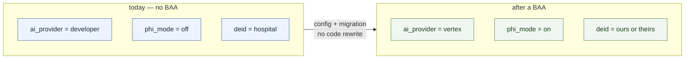

# Designing for a BAA We Don't Have Yet

We hold no PHI today and cannot get a BAA as a student project. That is the right call now — and
it becomes a trap if the code assumes it forever.

**The goal: the day a BAA is signed, handling PHI is a configuration change and a migration, not
a rewrite.** Nothing below costs anything today. Each item is a seam placed where the break would
otherwise happen.

---

## 1. The seams

| # | Seam | Today | After a BAA | Cost now |
|---|---|---|---|---|
| 1 | AI provider | Gemini Developer API | Vertex AI, same SDK | one factory function |
| 2 | Data classification | everything is `reference` | some tables are `phi` | one enum |
| 3 | `ask_ai()` guard | refuses non-reference tasks | flag flips | five lines |
| 4 | Cache routing | one global `ai_cache` | tenant cache for scoped tasks | one branch |
| 5 | De-identification | hospital does it | may move inside our perimeter | a published contract |
| 6 | Patient continuity | no patient reference at all | opaque token → real linkage | one nullable column |
| 7 | Region | wherever it landed | pinned, contractual | a config value |
| 8 | Log redaction | nothing sensitive to redact | mandatory | middleware now |
| 9 | Deletion path | nothing to delete | return-or-destroy clause | one endpoint |
| 10 | Subprocessor list | informal | contractual annex | a markdown table |



---

## 2. Seam 1 — the AI provider

`shared/medstock_shared/ai.py:28` hardcodes the endpoint that has no BAA. The same SDK reaches
Vertex AI, which does. Make it a choice:

```python
def _make_client() -> genai.Client:
    if settings.ai_provider == "vertex":
        return genai.Client(
            vertexai=True,
            project=settings.gcp_project,
            location=settings.gcp_region,      # also the data-residency pin, seam 7
        )
    return genai.Client(api_key=settings.gemini_api_key)

_client = _make_client()
```

Config gains `ai_provider: str = "developer"`, `gcp_project`, `gcp_region`. Nothing else in
`ask_ai()` changes — request and response shapes are identical. **This is the whole migration for
seam 1**, and doing it now costs one function.

---

## 3. Seams 2–4 — classification, guard, cache routing

Today every AI task reads public data. Nothing enforces that, so the day someone adds a task that
doesn't, the global cache silently becomes a cross-tenant leak. Make the classification explicit
and let the code refuse:

```python
class DataClass(StrEnum):
    REFERENCE = "reference"   # public, global cache, no BAA needed
    TENANT    = "tenant"      # hospital-scoped, tenant cache, RLS
    PHI       = "phi"         # identifiable — requires phi_mode and a BAA


@dataclass(frozen=True)
class AITask:
    prompt: str
    validate: Callable | None
    data_class: DataClass = DataClass.REFERENCE
```

And the guard in `ask_ai()`, before anything else runs:

```python
task = TASKS[task_name]

if task.data_class is DataClass.PHI and not settings.phi_mode:
    raise AIError(f"task '{task_name}' is PHI-class and phi_mode is off")

cache = _global_cache if task.data_class is DataClass.REFERENCE else _tenant_cache
```

All four current tasks are `REFERENCE`, so this changes no behaviour. What it buys: adding a
PHI-class task without a BAA **fails loudly at the first call** instead of quietly writing
patient data into a table shared by every hospital. The comment in `models.py` promising the
cache never holds PHI stops being a promise and becomes an assertion.

---

## 4. Seam 5 — the de-identification contract

Today the hospital de-identifies at the edge. That may not survive contact with a real hospital —
some will hand over raw text and expect us to handle it.

Design it as a **named component with a published input contract**, not as an assumption:

```
raw record ──▶ [ de-identification gateway ] ──▶ feature vector ──▶ patient-profiling
                        ▲
              runs on their side today.
              Can run on ours after a BAA.
              Same output either way.
```

`patient-profiling` accepts the vector from `patient-profiling-usecases.md` §2.3 and nothing
else — it rejects any field it doesn't recognize rather than passing it through. That rejection
is what keeps the boundary real: a hospital cannot accidentally send us a name.

When a BAA exists, the gateway moves inside our perimeter and everything downstream is unchanged.
Google Sensitive Data Protection and AWS Comprehend Medical both do this transformation as a
managed, HIPAA-eligible service — so the future version is a service call, not a project.

---

## 5. Seam 6 — patient continuity without identity

The sharpest limitation of the no-PHI design is no history: the same patient tomorrow is a
stranger. Fixing that later requires a column that has to be designed now.

Add `patient_ref` to `assessment_log` — nullable, opaque, **generated by the hospital**:

- Random, not derived from any patient attribute
- We never receive the mapping, and never ask for it
- Under §164.514(c) a covered entity may assign such a code and remain de-identified toward us

That gives "this patient's third assessment this month" without us knowing who they are. The
column is nullable and unused today. After a BAA it is either kept as-is or joined to real
identity — but the schema does not have to change either way.

> **Careful:** if we ever hold the mapping, this becomes a limited data set — still PHI, needs a
> DUA. The value of the column depends entirely on us not having the key. Write that down next to
> the column.

---

## 6. Seams 7–10 — the cheap ones

**Region.** Pick it before the first migration and put it in config. Moving a database between
regions later is a project; setting a string now is not. `gcp_region` already appears in §2.

**Log redaction.** Add the middleware while there is nothing sensitive to redact:

```python
NEVER_LOG = {"/assess", "/assess/batch"}   # request bodies, ever
```

Request bodies on assessment routes are never logged, only `request_id`, `feature_hash`, and
timing. Retrofitting this after PHI arrives means auditing every log line ever written.

**Deletion.** Every BAA has a return-or-destroy clause and GDPR has erasure. `DELETE
/assess/{request_id}` costs nothing today — one row and its cache entry — and is very expensive
to invent under a contractual deadline.

**Subprocessor register.** A table in this repo: every third party that could touch data, what it
does, whether it will sign a BAA. Today it is Google (Gemini), the cloud provider, and nothing
else. It becomes a contract annex later, and it is the thing nobody can reconstruct from memory.

---

## 7. What we deliberately defer

Rollout to a hospital is the stated intent, so these are scheduled work rather than out of
scope — but building them before the BAA exists is waste, because none of them constrain the
architecture:

- Encryption beyond what the managed services already do at rest and in transit
- A consent management system
- Break-glass emergency access
- Access-review workflows and workforce training records
- Anything shaped like a compliance dashboard

These are program work, not architecture. They arrive with the BAA. The seams in §1 are the
things that must exist first, because they are the ones that are expensive to retrofit.

Demo data is governed separately — see [demo-data.md](demo-data.md). The short version: real
reference data, synthetic patients, and no real patient record ever enters the system or the
repository, BAA or not.

---

## 8. What is already right

Worth stating, because these were built for other reasons and happen to be HIPAA controls:

| Existing design | HIPAA control it satisfies |
|---|---|
| Append-only `audit_log_entry`, enforced by `REVOKE`, written by a trigger | §164.312(b) audit controls — the strongest one to demonstrate |
| Row-level security keyed on `app.hospital_id` | §164.312(a) access control, tenant isolation |
| Local JWT verification, role-based permissions | §164.308(a)(4) minimum necessary |
| No PHI in URLs or query strings | §164.312(e) transmission security |
| Pharmacist approves every substitution | §164.308(a)(1) — a human, not software, makes the clinical call |

The audit trigger is the one to put on a slide. Most projects claim an audit log; ours cannot be
switched off by application code, because the application role has no `UPDATE` or `DELETE` grant
on the table.

---

## 9. The day the BAA is signed

In order:

1. Set `ai_provider=vertex`, `gcp_project`, `gcp_region`. Rotate the Developer API key out.
2. Confirm every service in use is on the provider's HIPAA-covered list. Cloud SQL, GKE, Secret
   Manager and Vertex AI are; check the rest.
3. Enable CMEK on the database and any bucket.
4. Migration: add PHI-class tables, tenant RLS policies, and the `patient_ref` join if identity
   is now in scope.
5. Flip `phi_mode=true` — the guard in §3 stops rejecting PHI-class tasks.
6. Move the de-identification gateway inside the perimeter, or keep it at the hospital edge.
7. Turn on the program work from §7.

Steps 1, 5 and 6 are configuration. Step 4 is one migration. Nothing on this list is a rewrite,
which is the entire point of the document.
