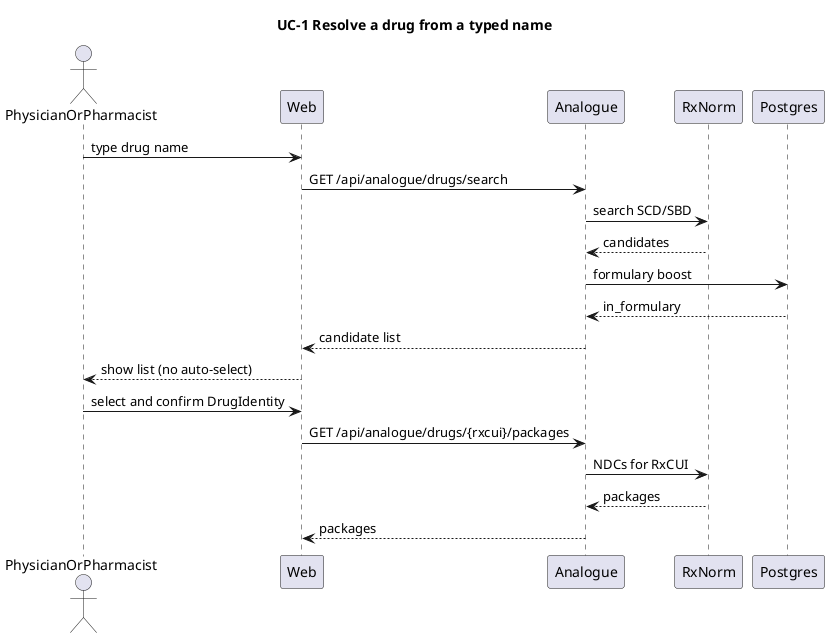
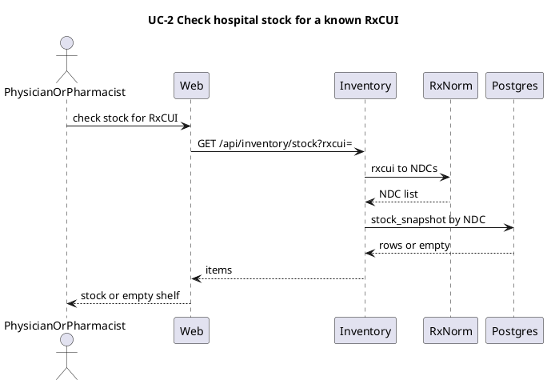
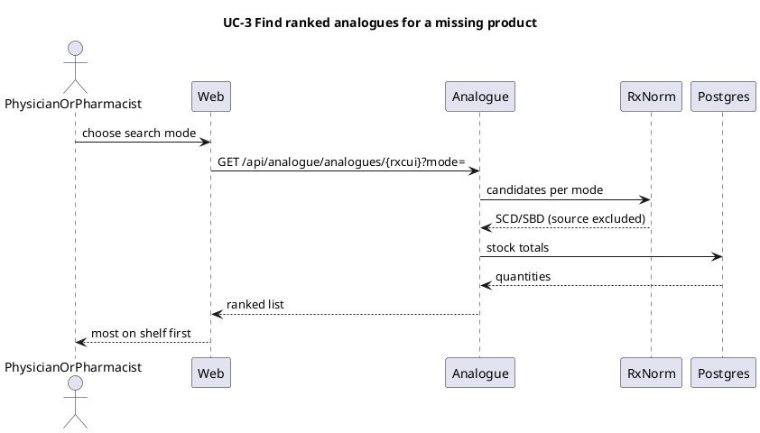
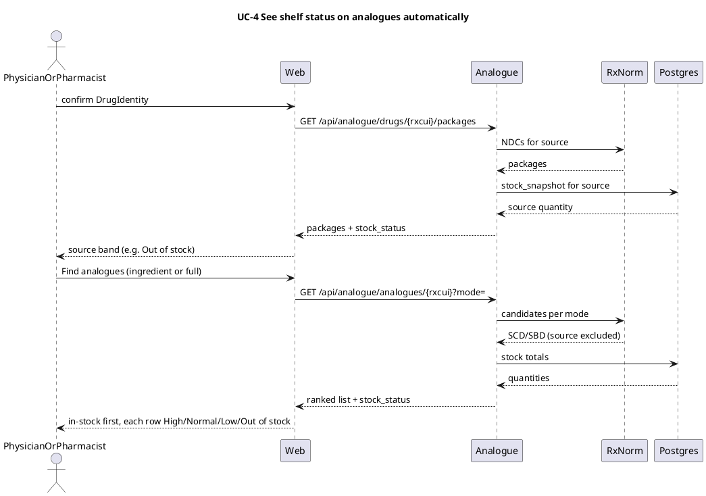
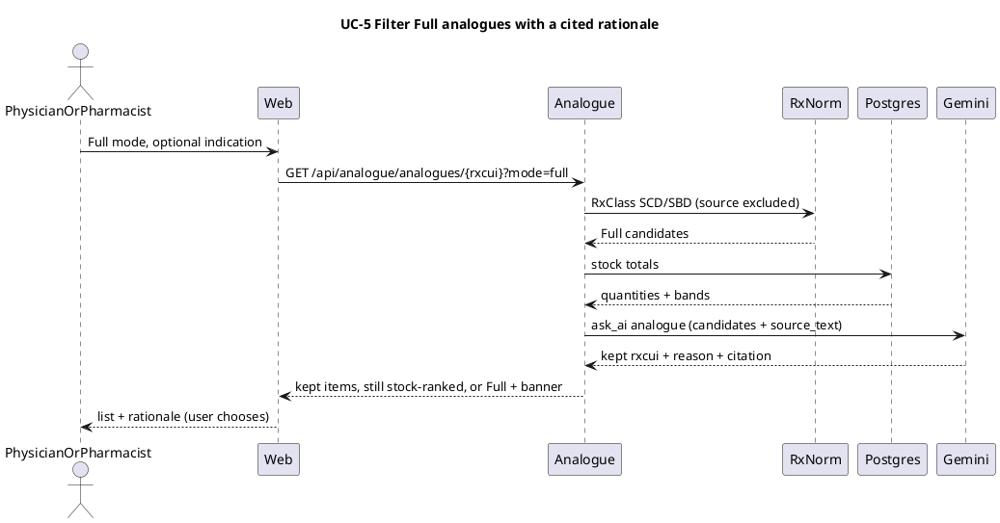

# MedStockAI use cases

MedStockAI lets a physician or pharmacist turn a typed drug name into a confirmed clinical identity, then check whether that product is on the hospital shelf.

## UC-1 — Resolve a drug from a typed name

A physician or pharmacist types a name (and optionally a strength) in the web app. Analogue searches live RxNorm and returns SCD/SBD candidates, optionally boosting hospital-formulary hits from Postgres. The client never auto-selects, even when there is only one hit. The user picks a `DrugIdentity` (RxCUI SCD/SBD) and confirms it. Confirmation loads packages (NDCs) for that RxCUI.

After confirm, UC-4 shows this product’s shelf band on the same page (no /inventory hop).

## UC-2 — Check hospital stock for a known RxCUI

The same user already has an RxCUI and asks whether the hospital has it on the shelf. Inventory maps that RxCUI to NDCs via RxNorm, then looks up those NDCs in Postgres `stock_snapshot`. An empty `items` list is a valid outcome: the concept is known, but nothing is on the shelf. Success is showing whatever is there, including none.

UC-2 starts from the RxCUI produced by UC-1.

## UC-3 — Find ranked analogues for a missing product

The physician or pharmacist has a confirmed RxCUI from UC-1, and UC-2 showed an empty shelf. They ask for analogues and choose a **search mode** (how related products are found). Analogue gathers SCD/SBD candidates from RxNorm for that mode, excludes the source RxCUI, totals hospital stock per candidate, and returns the list ranked by on-hand quantity: most on the shelf first, then less, then products that exist in RxNorm but are not on the shelf. Gemini does not rank this list. Nothing is auto-selected. An empty list is valid.

Search modes (user-selectable):

1. **Same active ingredient** — RxNorm ingredient (IN) → other SCD/SBD (form, strength, or brand). In scope now.
2. **Full / therapeutic alternative** — different ingredient, same RxClass as the source (ATC if present, otherwise VA / MESHPA). The list itself is Gemini-free. UC-5 optionally filters it.
3. **Therapeutic equivalence (Orange Book / TE codes)** — AB-rated generics, same form and strength. Later (US-formulary practice).
4. **Pharmacologic class (ATC / RxClass)** — explicit class picker. Later; Full already uses a primary class.

UC-3 starts from an empty UC-2 shelf for the UC-1 RxCUI. UC-4 is the stock-aware presentation of this list (bands + English labels), not a new ranking algorithm. UC-5 optionally filters the Full list only.

### How to test

Open http://127.0.0.1:3000/analogue (pharmacist JWT is seeded in local dev). Search `aspirin 325`, pick **aspirin 325 MG Oral Tablet** (RxCUI 212033 — not on the shelf; seeded stock is aspirin 100 mg / 246461), and confirm the DrugIdentity. Leave **Ingredient** selected and click **Find analogues**. Expect other aspirin strengths/forms, 212033 excluded, ranked by quantity (100 mg near the top if seeded). Switch to **Full (therapeutic)** and search again: other ingredients in the same RxClass, still ranked, source still excluded. Optional: **Check inventory** first to see the empty shelf.

## UC-4 — See shelf status on analogues automatically

The physician or pharmacist has a confirmed RxCUI from UC-1. After confirm they already see the **source** drug’s shelf band (Aspirin 325 as none / out of stock) without opening Inventory. They then search analogues (`ingredient` or `full`). Stock is attached in that same analogue call. Each row shows name, RxCUI, pack quantity, and a qualitative band. In-stock analogues appear first (high → normal → low), then none. Nothing is auto-selected.

UC-4 is the stock-aware presentation of UC-3, not a new ranking algorithm.

Thresholds (absolute pack counts, one shared helper):

- `none`: quantity == 0
- `low`: 1–20
- `normal`: 21–100
- `high`: >100

### How to test

- Open http://127.0.0.1:3000/analogue (pharmacist JWT is seeded in local dev).
- Search `aspirin 325` → confirm **aspirin 325 MG Oral Tablet** (RxCUI 212033) → source should read **Out of stock**.
- Select **Full (therapeutic)** → **Find analogues** → in-stock first; each row has High / Normal / Low / Out of stock plus the pack quantity.

## UC-5 — Filter Full analogues with a cited rationale

The physician or pharmacist has a Full (therapeutic) list from UC-3/UC-4: other ingredients in the same RxClass, source RxCUI excluded, stock bands attached, ranked high stock first. That list is noisy (wrong route, wrong dose-form family, pediatric vs adult, not substitutable in practice). They may type an optional **indication** string (no PHI; empty means class-only clinical intent). Analogue calls `ask_ai("analogue", …)` on **that candidate list**, not on raw RxNorm. Gemini **filters** (drops nonsensical rows, keeps about 3–7) and attaches `reason` + `citation` to each kept row. It does not change stock numbers, does not add drugs that were not in the candidate list, and does not auto-approve. The client still shows **UC-4 stock order among kept rows** (high → normal → low → none). The user picks; showing the rationale is enough HITL for this UC (approve/reject queue is later). Ingredient mode never calls Gemini. Inventory never calls Gemini.

`source_text` is the citation ground truth (`citation` must be a verbatim substring). This UC **does not add an ingest**. Build `source_text` from structured facts already on the candidates (names, dose forms, “not the same ingredient”, stock band labels) plus a shortage/label snippet **only if that text is already in Postgres**. Ingest for `shortage_event` / labels is still unscheduled, so most calls will have no external snippet; citations will usually quote those assembled facts, not an FDA label. Indication is prompt context only — do not put the free-text indication into `source_text` (that would let the model cite the user’s own words as evidence). Payload must be cache-stable: source rxcui/name/form, indication (empty string when unused), candidates (`rxcui`, `name`, `tty`, `quantity`, `stock_status`), and `source_text`. No timestamps. If Gemini 503s or `validate()` rejects the answer, show the **unfiltered Full list** with a banner “rationale unavailable”. Never empty the list just because the model failed. A valid keep-set that intersects to nothing is the same fallback.

### How to test

Open http://127.0.0.1:3000/analogue (pharmacist JWT). Search `aspirin 325`, confirm a
preparation, switch to **Full (therapeutic)**, leave **Use AI** on, **Find analogues**.
Expect at most 5 rows, each with Shelf status and a short reason. Uncheck Use AI and search
again: the unfiltered Full list, longer than 5. If Gemini fails, a warning banner says the
list is unfiltered — not an empty table. **Ingredient** must not call Gemini.

## UC-P — Physician appointment cart (demo)

Capstone physician flow under **analogue → tab Призначення**. Search drugs, add them to a **browser-only** appointment cart, select (or create) a patient profile stored in Postgres, re-check contraindications on every cart change, show warnings, replace a line with an analogue that excludes the avoided ingredient, then Accept to show a prescription summary and clear the cart.

The **Пошук аналогів** tab keeps UC-1..5 unchanged (no patient).

**Demo PHI exception:** `patient` stores name / DOB / blood group for the UI. `/cart-check` maps the row to a de-identified `PatientVector` before `assess()` — the rules engine still never sees PHI. Not production BAA posture.

### How to test

1. Run `patient-profiling` on port 8003 (Next proxies `/api/patients`). Seed: `uv run python scripts/seed_patients.py --count 1000` — it resolves the tenant by hospital name, so run the auth seed first, or pass `--hospital-id <hospital uuid>`.
2. Open http://127.0.0.1:3001/analogue?tab=pryznachennia as physician (`ben@stmarys.org` / `devpassword123`).
3. Select **Elena Vasquez** (seeded with `avoid_caffeine`) or create a patient with that condition.
4. Search `aspirin caffeine`, **Add** **aspirin 400 MG / caffeine 32 MG Oral Tablet** (RxCUI 198479) → warning badge.
5. Open the warning → **Find analogues without this ingredient** → **Replace with analogue** (e.g. aspirin-only). When `GEMINI_API_KEY` is set, Full-mode analogues are AI-filtered (UC-5); otherwise the stock-ranked Full list with ingredient exclusion only.
6. **Accept & generate prescription** → summary modal; cart clears for the next patient.

UC-1..5 regression check: open **Пошук аналогів** (`/analogue`) — search, confirm, ingredient/full analogues, optional Gemini on Full — same as before; no patient UI on that tab.
